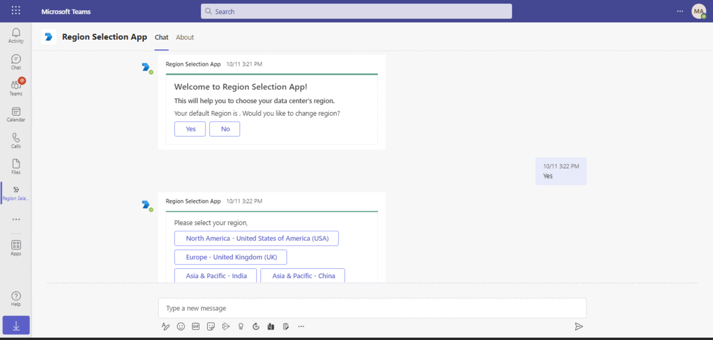
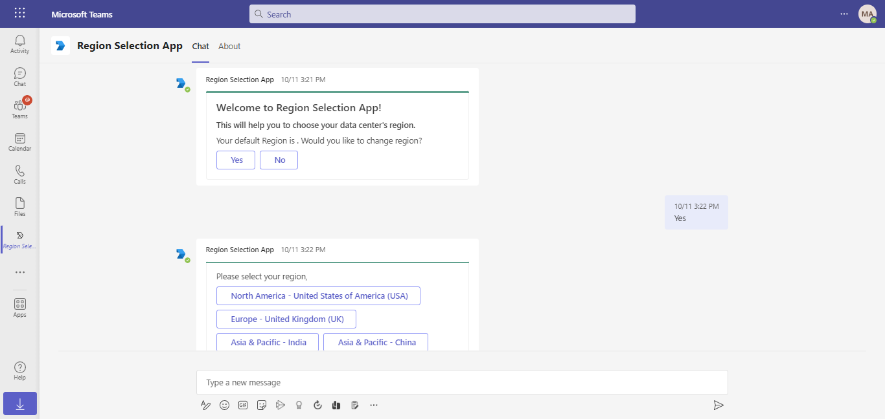
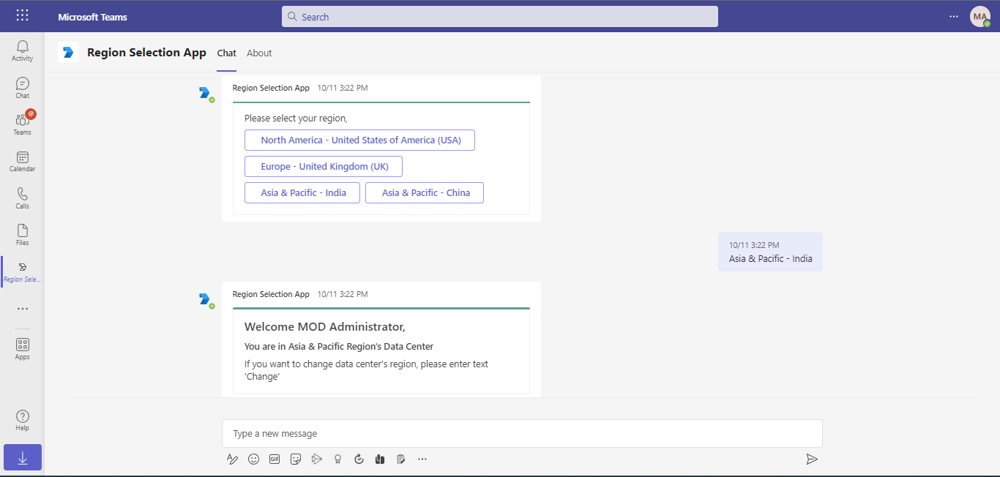
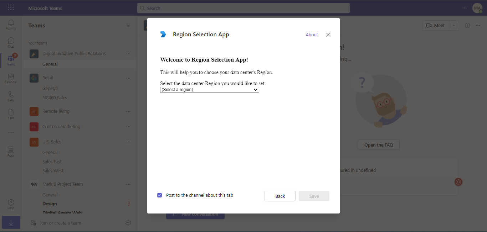
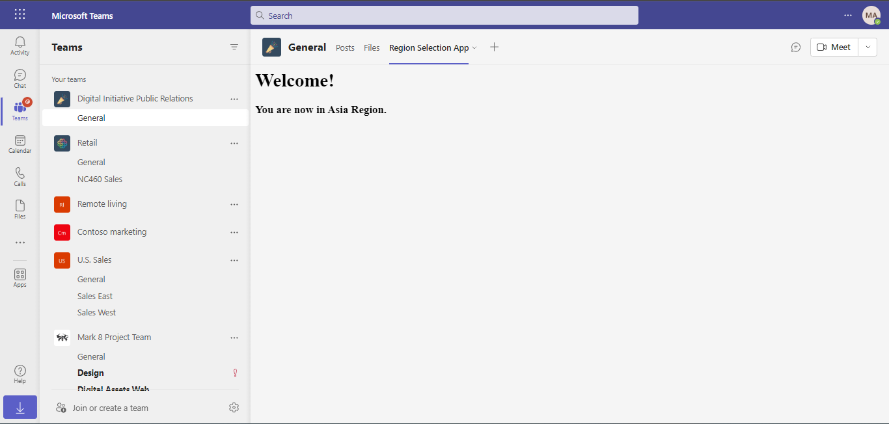

# Region Selection App

Bot Framework v4 Region Selection sample.

This bot has been created using [Bot Framework](https://dev.botframework.com), for the region selection for the app's data center using Bot and Tab.

- **Interaction with app**


## Prerequisites

- [.NET Core SDK](https://dotnet.microsoft.com/download) version 6.0

  ```bash
  # determine dotnet version
  dotnet --version
  ```
- Publicly addressable https url or tunnel such as [ngrok](https://ngrok.com/) or [Tunnel Relay](https://github.com/OfficeDev/microsoft-teams-tunnelrelay)

- [Teams](https://teams.microsoft.com) Microsoft Teams is installed and you have an account

## Setup

### 1. Setup for Bot

- Register a bot with Azure Bot Service, following the instructions [here](https://docs.microsoft.com/en-us/azure/bot-service/bot-service-quickstart-registration?view=azure-bot-service-3.0).
- Ensure that you've [enabled the Teams Channel](https://docs.microsoft.com/en-us/azure/bot-service/channel-connect-teams?view=azure-bot-service-4.0)
- While registering the bot, use `https://<your_ngrok_url>/api/messages` as the messaging endpoint.
    > NOTE: When you create your bot you will create an App ID and App password - make sure you keep these for later.

### 2. Setup NGROK
1) Run ngrok - point to port 3978

```bash
# ngrok http -host-header=rewrite 3978
```

### 3. Setup for code

- Clone the repository

    ```bash
    git clone https://github.com/OfficeDev/Microsoft-Teams-Samples.git
    ```

- Run the bot from a terminal or from Visual Studio:

  A) From a terminal, navigate to `samples/app-region-selection/RegionSelectionApp`

  ```bash
  # run the bot
  dotnet run
  ```

  B) Or from Visual Studio

  - Launch Visual Studio
  - File -> Open -> Project/Solution
  - Navigate to `samples/app-region-selection/RegionSelectionApp` folder
  - Select `RegionSelectionApp.sln` file
  - Press `F5` to run the project

 - Update the `appsettings.json` configuration for the bot to use the MicrosoftAppId, MicrosoftAppPassword generated in Step 1 (Setup for Bot). (Note the App Password is referred to as the "client secret" in the azure portal and you can always create a new client secret anytime.)

 ### 4. Setup Manifest for Teams
1) __*This step is specific to Teams.*__
    - **Edit** the `manifest.json` contained in the  `TeamsAppManifest` folder to replace your Microsoft App Id (that was created when you registered your bot earlier) *everywhere* you see the place holder string `<<Your Microsoft App Id>>` (depending on the scenario the Microsoft App Id may occur multiple times in the `manifest.json`)
    - **Edit** the `manifest.json` for `configurationUrl` inside `configurableTabs` . Replace `<yourNgrok.ngrok.io>` with base Url domain. E.g. if you are using ngrok it would be `https://1234.ngrok.io` then your domain-name will be `1234.ngrok.io`.
    - **Edit** the `manifest.json` for `validDomains` with base Url domain. E.g. if you are using ngrok it would be `https://1234.ngrok.io` then your domain-name will be `1234.ngrok.io`.
    - **Zip** up the contents of the `TeamsAppManifest` folder to create a `manifest.zip` (Make sure that zip file does not contains any subfolder otherwise you will get error while uploading your .zip package)
    - **Upload** the `manifest.zip` to Teams (In Teams Apps/Manage your apps click "Upload an app". Browse to and Open the .zip file. At the next dialog, click the Add button.)
    - Add the app to personal/team/groupChat scope (Supported scopes)

## Running the sample

Install the Region Selection App manifest in Microsoft Teams. @mention the region selection bot to start the conversation.
- Bot sends an Adaptive card in chat

- Select the region from the card. Bot sets the selected region and notify user in chat


## Interacting with Region Selection Tab

- Set up the region selection app as a Tab in channel

- Tab will display the selected region


## Deploy the bot to Azure

To learn more about deploying a bot to Azure, see [Deploy your bot to Azure](https://aka.ms/azuredeployment) for a complete list of deployment instructions.


## Further reading
- [Overview for Microsoft Teams App](https://docs.microsoft.com/en-us/microsoftteams/platform/build-your-first-app/build-first-app-overview)
- [Build a Configurable Tab for Microsoft Teams App](https://docs.microsoft.com/en-us/microsoftteams/platform/build-your-first-app/build-channel-tab)
- [Build a Bot](https://docs.microsoft.com/en-us/microsoftteams/platform/build-your-first-app/build-bot)

