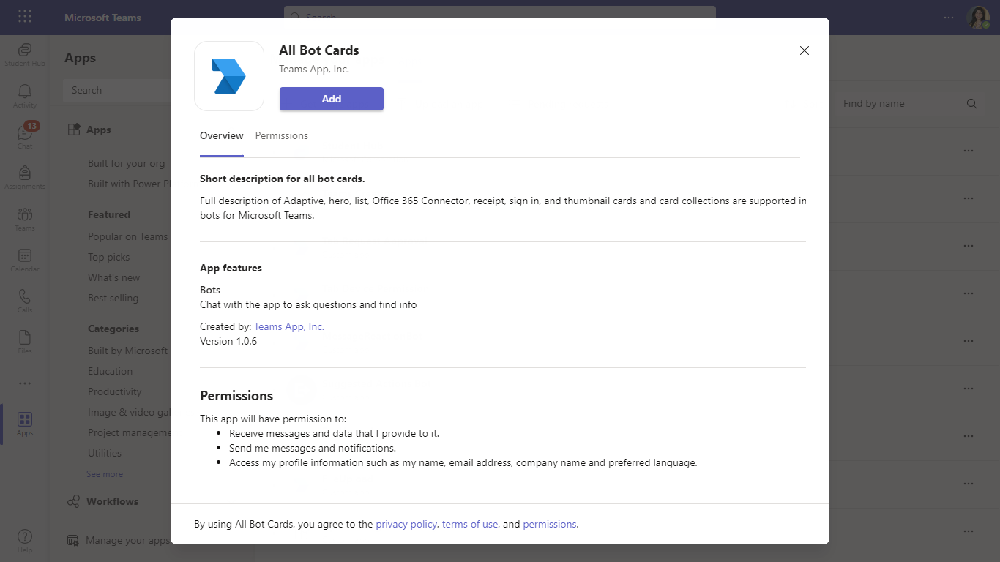
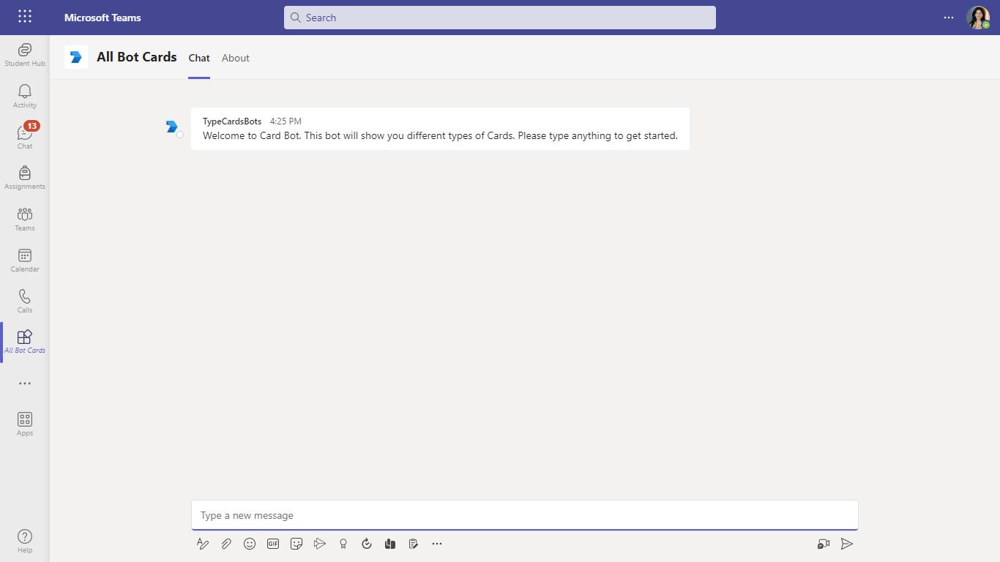
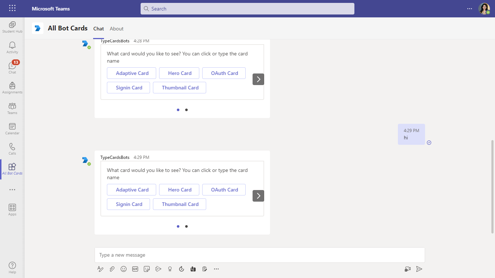
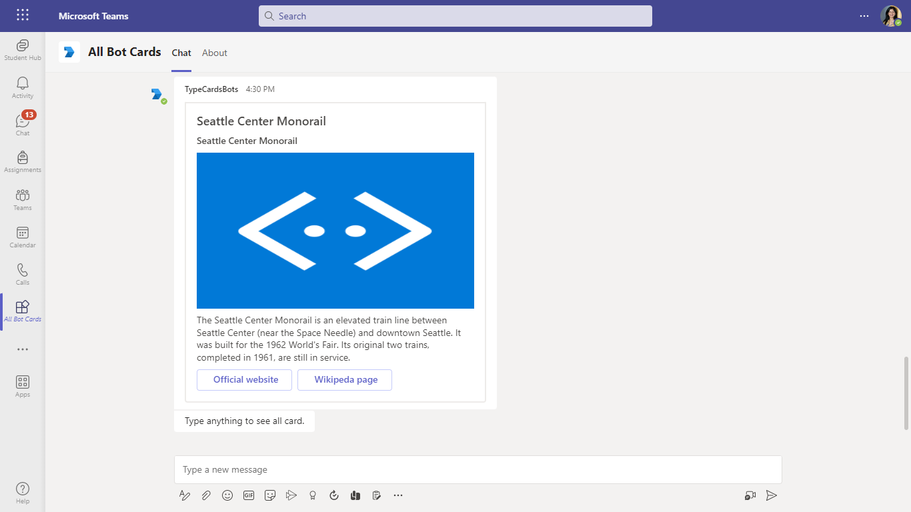
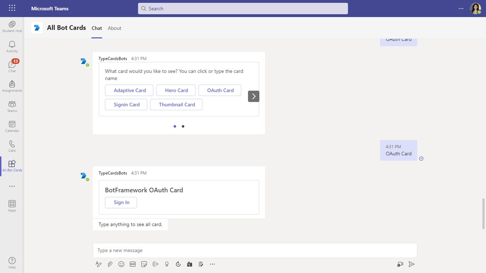
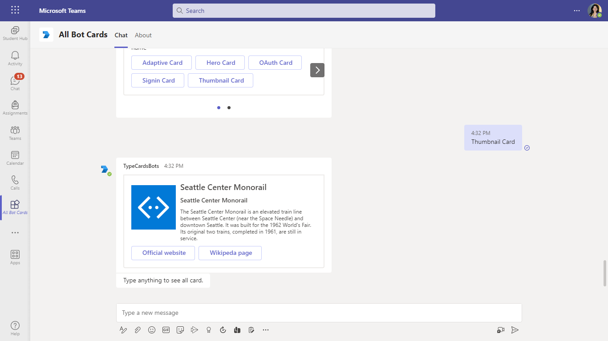
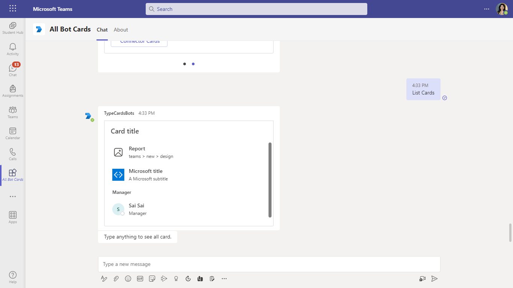
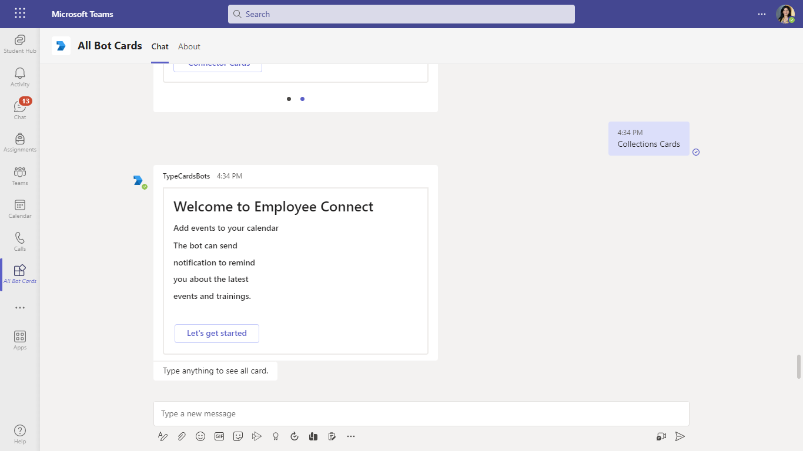
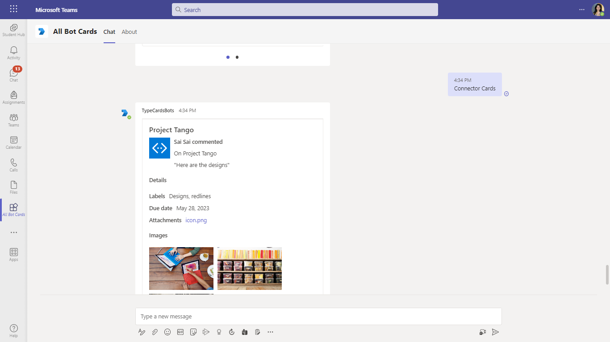

---
page_type: sample
products:
- office-teams
- office
- office-365
languages:
- csharp
title: Microsoft Teams C# Type of Bot Cards
description: Microsoft Teams "Type of Bot Cards" application for .NET/C#
extensions:
  contentType: samples
  createdDate: 01/11/2023 10:02:21 PM
urlFragment: officedev-microsoft-teams-samples-bot-all-cards-csharp
---

# Using Cards

Bot Framework v4 using cards bot sample

This bot has been created using [Bot Framework](https://dev.botframework.com), it shows how to create a bot that uses rich cards to enhance your bot design.

## Interaction with app


## Prerequisites

- [.NET Core SDK](https://dotnet.microsoft.com/download) version 6.0

  ```bash
  # determine dotnet version
  dotnet --version
  ```
- Publicly addressable https url or tunnel such as [ngrok](https://ngrok.com/) or [Tunnel Relay](https://github.com/OfficeDev/microsoft-teams-tunnelrelay)

## Setup

### 1. Setup for Bot
- Register a bot with Azure Bot Service, following the instructions [here](https://docs.microsoft.com/en-us/azure/bot-service/bot-service-quickstart-registration?view=azure-bot-service-3.0).

- Ensure that you've [enabled the Teams Channel](https://docs.microsoft.com/en-us/azure/bot-service/channel-connect-teams?view=azure-bot-service-4.0)

- While registering the bot, use `https://<your_ngrok_url>/api/messages` as the messaging endpoint.
    > NOTE: When you create your bot you will create an App ID and App password - make sure you keep these for later.

### 2. Setup NGROK
1) Run ngrok - point to port 5000

    ```bash
    # ngrok http -host-header=rewrite 5000
    ```
### 3. Setup for code
- Clone the repository

    ```bash
    git clone https://github.com/OfficeDev/Microsoft-Teams-Samples.git
    ```
 Run the bot from a terminal or from Visual Studio:

  A) From a terminal, navigate to `samples/bot-all-cards/csharp/BotAllCards`

  ```bash
  # run the bot
  dotnet run
  ```

  B) Or from Visual Studio

  - Launch Visual Studio
  - File -> Open -> Project/Solution
  - Navigate to `samples/bot-all-cards/csharp/BotAllCards` folder
  - Select `BotAllCards.csproj` file
  - Press `F5` to run the project   

### 4. Setup Manifest for Teams

- **This step is specific to Teams.**

1) Modify the `manifest.json` in the `/Manifest` folder and replace the following details:
  - `{{Microsoft-App-Id}}` with Application id generated from Step 1
  - `{{domain-name}}` with base Url domain. E.g. if you are using ngrok it would be `1234.ngrok.io`

2) Zip the contents of `Manifest` folder into a `manifest.zip`.

3) Modify the `/appsettings.json` and fill in the following details:
  - `{{Microsoft-App-Id}}` - Generated from Step 1 is the application app id
  - `{{ Microsoft-App-Password}}` - Generated from Step 1, also referred to as Client secret
  - `{{ Microsoft-App-TenantId }}` - Generated from Step 1 is the tenantId id
  
5) Upload the manifest.zip to Teams (in the Apps view click "Upload a custom app")
   - Go to Microsoft Teams. From the lower left corner, select Apps
   - From the lower left corner, choose Upload a custom App
   - Go to your project directory, the ./Manifest folder, select the zip folder, and choose Open.
   - Select Add in the pop-up dialog box. Your app is uploaded to Teams.

## Running the sample

**Install App:**



**Welcome Cards:**



**All Cards:**



**Adaptive Card:**


**Hero Card:**



**OAuth Card:**



**Signin Card:**


**Thumbnail Card:**



**List Card:**



**Collections Card:**



**Connector Card:**




## Deploy the bot to Azure

To learn more about deploying a bot to Azure, see [Deploy your bot to Azure](https://aka.ms/azuredeployment) for a complete list of deployment instructions.

## Further reading

- [Types of cards](https://learn.microsoft.com/en-us/microsoftteams/platform/task-modules-and-cards/cards/cards-reference#receipt-card)
