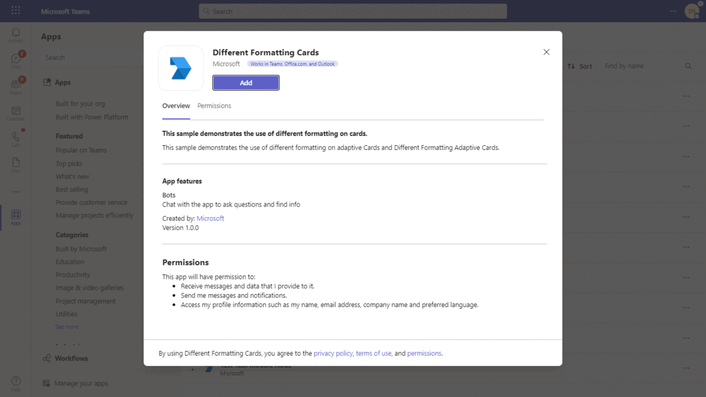
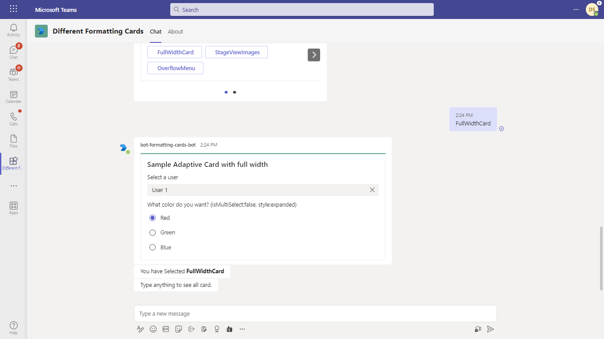
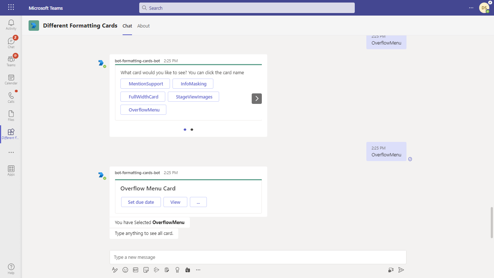
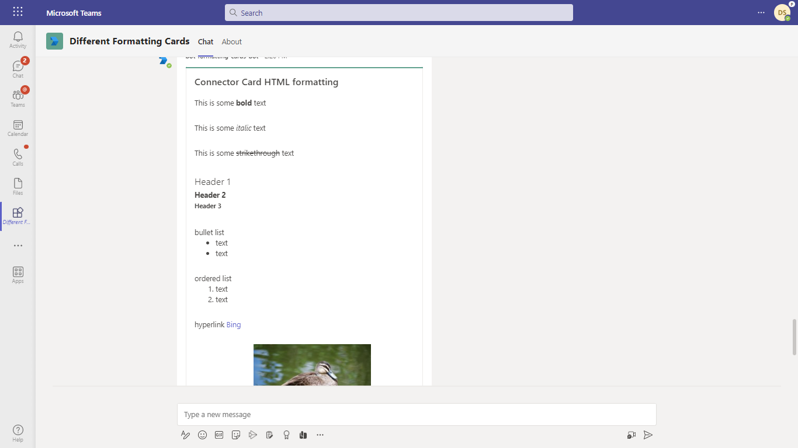
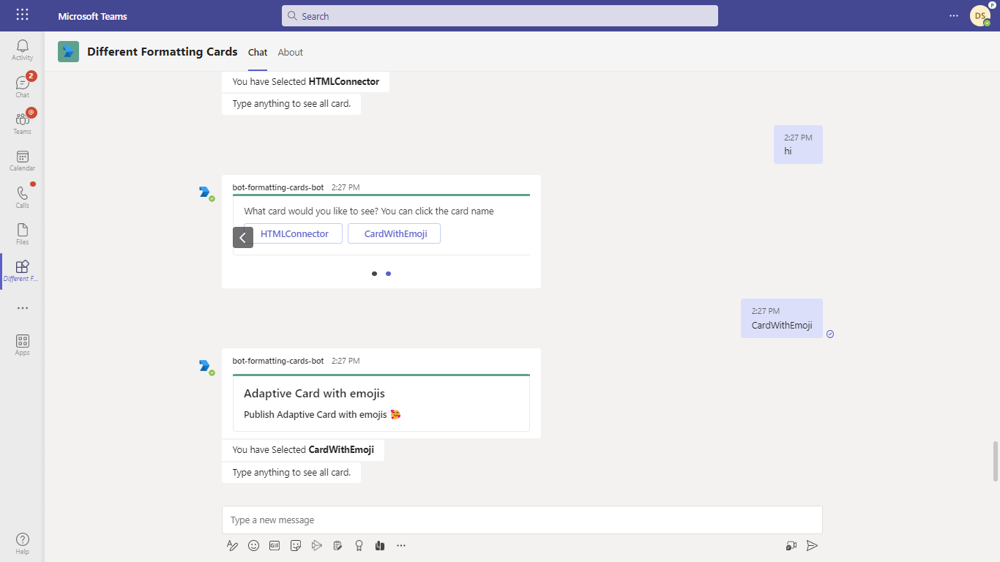

# Different Formatting Cards

This sample shows the feature where user can send different formatting on cards using bot.

## Interaction with app



## Prerequisites

- Microsoft Teams is installed and you have an account (not a guest account).

- [.NET Core SDK](https://dotnet.microsoft.com/download) version 6.0

  ```bash
  # determine dotnet version
  dotnet --version
  ```
- Publicly addressable https url or tunnel such as [ngrok](https://ngrok.com/) or [Tunnel Relay](https://github.com/OfficeDev/microsoft-teams-tunnelrelay)

## Setup

1. Register a new application in the [Azure Active Directory – App Registrations](https://go.microsoft.com/fwlink/?linkid=2083908) portal.

    1) Select **New Registration** and on the *register an application page*, set following values:
        * Set **name** to your app name.
        * Choose the **supported account types** (any account type will work)
        * Leave **Redirect URI** empty.
        * Choose **Register**.

    2) On the overview page, copy and save the **Application (client) ID, Directory (tenant) ID**. You’ll need those later when updating your Teams application manifest and in the appsettings.json.

    3) Navigate to the **Certificates & secrets**. In the Client secrets section, click on "+ New client secret". Add a description      (Name of the secret) for the secret and select “Never” for Expires. Click "Add". Once the client secret is created, copy its value, it need to be placed in the appsettings.json.

2. Setup for Bot
    - In Azure portal, create a [Azure Bot resource](https://docs.microsoft.com/en-us/azure/bot-service/bot-builder-authentication?view=azure-bot-service-4.0&tabs=csharp%2Caadv2).
   - Ensure that you've [enabled the Teams Channel](https://docs.microsoft.com/en-us/azure/bot-service/channel-connect-teams?view=azure-bot-service-4.0)
   - While registering the bot, use `https://<your_ngrok_url>/api/messages` as the messaging endpoint.

3. Setup NGROK  
   Run ngrok - point to port 3978

    ```bash
    ngrok http -host-header=rewrite 3978
    ```

4. Setup for code  
   - Clone the repository

    ```bash
    git clone https://github.com/OfficeDev/Microsoft-Teams-Samples.git
    ```
    Run the bot from a terminal or from Visual Studio:

  A) From a terminal, navigate to `samples/bot-formatting-cards/csharp/BotFormattingCards`

     ```bash
     # run the bot
     dotnet run
     ```
  B) Or from Visual Studio

    - Launch Visual Studio
    - File -> Open -> Project/Solution
    - Navigate to `samples/bot-formatting-cards/csharp/BotFormattingCards` folder
    - Select `BotFormattingCards.csproj` file
    - Press `F5` to run the project   
  
- Update the `.env` configuration file and replace with placeholder `{{Microsoft-App-Id}}` and `{{Microsoft-App-Password}}`. (Note the MicrosoftAppId is the AppId created in step 1 (Setup AAD app registration in your Azure portal), the MicrosoftAppPassword is referred to as the "client secret" in step 1 (Setup for Bot) and you can always create a new client secret anytime.)

- Navigate to samples\bot-formatting-cards\csharp\BotFormattingCards\Resources\mentionSupport.json
On line 31, replace {{Microsoft-App-Id}}.

**Note:**
-   If you are facing any issue in your app,  [please uncomment this line](https://github.com/OfficeDev/Microsoft-Teams-Samples/blob/5a6093539bead5e38c1a19e00d4a2ef8ac1df7d2/samples/bot-formatting-cards/csharp/BotFormattingCards/AdapterWithErrorHandler.cs#L27) and put your debugger for local debug.

5. Setup Manifest for Teams
- __*This step is specific to Teams.*__
    - **Edit** the `manifest.json` contained in the ./Manifest folder to replace your MicrosoftAppId (that was created when you registered your app registration earlier) *everywhere* you see the place holder string `{{Microsoft-App-Id}}` (depending on the scenario the Microsoft App Id may occur multiple times in the `manifest.json`)
    - **Edit** the `manifest.json` for `validDomains` and replace `{{domain-name}}` with base Url of your domain. E.g. if you are using ngrok it would be `https://1234.ngrok.io` then your domain-name will be `1234.ngrok.io`.
    - **Zip** up the contents of the `Manifest` folder to create a `manifest.zip` (Make sure that zip file does not contains any subfolder otherwise you will get error while uploading your .zip package)

- Upload the manifest.zip to Teams (in the Apps view click "Upload a custom app")
   - Go to Microsoft Teams. From the lower left corner, select Apps
   - From the lower left corner, choose Upload a custom App
   - Go to your project directory, the ./AppPackage folder, select the zip folder, and choose Open.
   - Select Add in the pop-up dialog box. Your app is uploaded to Teams.

## Running the sample

**Install App:**


**Welcome Message:**


**Type Of Cards:**


**Mention Card:**


**Information Mask Card:**


**FullWidth Adaptive Card:**



**Stage View Card:**


**Overflow Menu Card:**



**HTML Connector Card:**



**AdaptiveCard With Emoji:**



## Deploy the bot to Azure

To learn more about deploying a bot to Azure, see [Deploy your bot to Azure](https://aka.ms/azuredeployment) for a complete list of deployment instructions.

## Further reading
- [Format cards in Microsoft Teams](https://learn.microsoft.com/en-us/microsoftteams/platform/task-modules-and-cards/cards/cards-format?tabs=adaptive-md%2Cdesktop%2Cconnector-html)
- [Format cards with HTML](https://learn.microsoft.com/en-us/microsoftteams/platform/task-modules-and-cards/cards/cards-format?tabs=adaptive-md%2Cdesktop%2Cconnector-html#format-cards-with-html)
