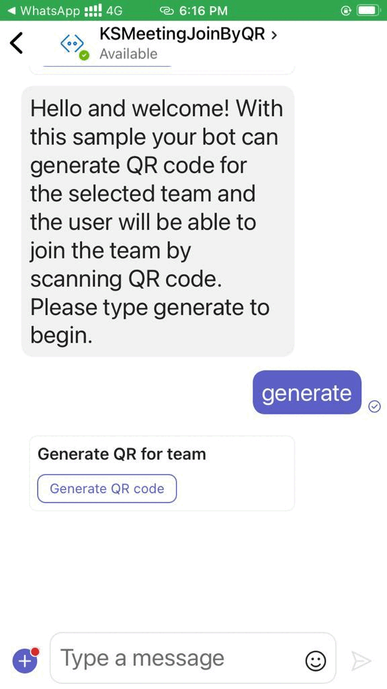
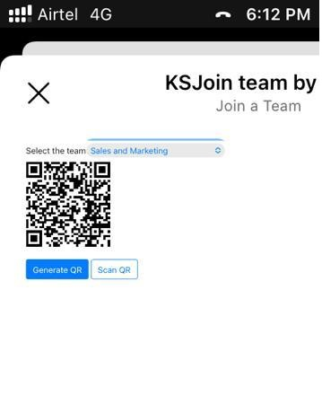
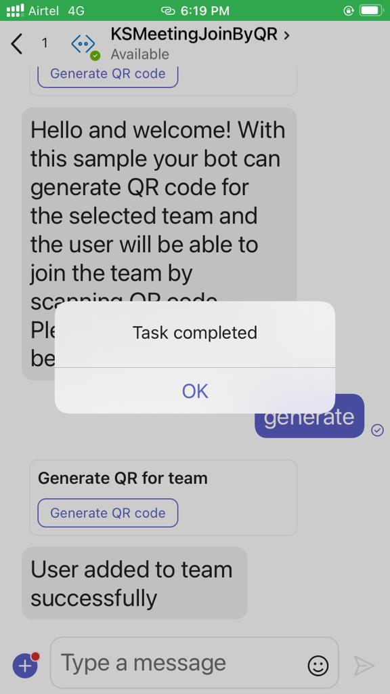

# Join a team using QR code sample

This sample demos a feature where user can join a team using QR code containing the team's id.

User can generate a new QR code (contains team id information) and then scan the QR code to join the team.

`Currently, Microsoft Teams support for QR or barcode scanner capability is only supported for mobile clients`

## Interaction with app

 

## Prerequisites

- [.NET Core SDK](https://dotnet.microsoft.com/download) version 3.1

  determine dotnet version
  ```bash
  dotnet --version
  ```
- [Ngrok](https://ngrok.com/download) (For local environment testing) Latest (any other tunneling software can also be used)
  
- [Teams](https://teams.microsoft.com) Microsoft Teams is installed and you have an account

## Setup
1. Register a new application in the [Azure Active Directory – App Registrations](https://go.microsoft.com/fwlink/?linkid=2083908) portal.  
    
  - Navigate to **API Permissions**, and make sure to add the follow permissions:
   - Select Add a permission
   - Select Microsoft Graph -\> Delegated permissions.
       * User.Read (enabled by default)
       * Directory.AccessAsUser.All
       * TeamMember.ReadWrite.All
       * Click on Add permissions.

   

2. Setup for Bot
	
	- Also, register a bot with Azure Bot Service, following the instructions [here](https://docs.microsoft.com/en-us/azure/bot-service/bot-service-quickstart-               registration?view=azure-bot-service-3.0).
	- Ensure that you've [enabled the Teams Channel](https://docs.microsoft.com/en-us/azure/bot-service/channel-connect-teams?view=azure-bot-service-4.0)
	- While registering the bot, use `https://<your_ngrok_url>/api/messages` as the messaging endpoint.

    > NOTE: When you create your app registration, you will create an App ID and App password - make sure you keep these for later.
    
  -In the Azure Portal, navigate back to the Azure Bot resource created (https://learn.microsoft.com/en-us/microsoftteams/platform/bots/how-to/authentication/add-authentication?tabs=dotnet%2Cdotnet-sample#azure-ad-v2)
  -Switch to the "Settings" blade and click "Add Setting" under the OAuth Connection Settings section
  - Enter a name for your new Connection setting.  
    - In the Service Provider dropdown, select Azure Active Directory V2
    - Enter in the client id and client secret obtained in step 1 and 1
    - For the Token Exchange URL use the Application ID URL obtained in step 1
    - Specify "common" as the Tenant ID
    - Add all the scopes configured when specifying permissions to downstream APIs in step 1
    - Click "Save"

3. Setup NGROK
      - Run ngrok - point to port 3978

	```bash
	# ngrok http -host-header=rewrite 3978
	```   
4. Setup for code

  - Clone the repository

    ```bash
    git clone https://github.com/OfficeDev/Microsoft-Teams-Samples.git
    ```
  - Modify the `/appsettings.json` and fill in the following details:
   - `{{ MicrosoftAppId }}` - Generated from Step 1 is the application app id
   - `{{ MicrosoftAppPassword }}` - Generated from Step 1, also referred to as Client secret
   - `{{ ConnectionName }}` - Generated from Step 2, is the name that we provide while adding OAuth connection setting in Azure Bot resource.
    Please follow [Add authentication to bot](https://docs.microsoft.com/en-us/microsoftteams/platform/bots/how-to/authentication/add-authentication?tabs=dotnet%2Cdotnet-sample#azure-ad-v2) to configure the connection.
   - `{{ ApplicationBaseUrl }}` - Your application's base url. E.g. https://12345.ngrok.io if you are using ngrok.
   
   - In a terminal, navigate to `JoinTeamByQR`

    ```bash
    # change into project folder
    cd # JoinTeamByQR
    ```

- Run the bot from a terminal or from Visual Studio, choose option A or B.

 - From a terminal

   ```bash
   # run the bot
   dotnet run
   ```

 - Or from Visual Studio

  - Launch Visual Studio
  - File -> Open -> Project/Solution
  - Navigate to `samples/bot-join-team-using-qr-code/csharp` folder
  - Select `JoinTeamByQR.csproj` file
  - Press `F5` to run the project
   

5) Setup Manifest for Teams
- __*This step is specific to Teams.*__
    - **Edit** the `manifest.json` contained in the ./AppManifest folder to replace your Microsoft App Id (that was created when you registered your app registration earlier) *everywhere* you see the place holder string `{{Microsoft-App-Id}}` (depending on the scenario the Microsoft App Id may occur multiple times in the `manifest.json`)
    - **Edit** the `manifest.json` for `validDomains` and replace `{{domain-name}}` with base Url of your domain. E.g. if you are using ngrok it would be `https://1234.ngrok.io` then your domain-name will be `1234.ngrok.io`.
     - **Edit** the `manifest.json` for `webApplicationInfo` resource `"api://botid-{{MicrosoftAppId}}"` with base Url of your domain. E.g. if you are using ngrok it would be `https://1234.ngrok.io` then your domain-name will be `"api://botid-{{MicrosoftAppId}}"`.
    - **Zip** up the contents of the `AppManifest` folder to create a `manifest.zip` (Make sure that zip file does not contains any subfolder otherwise you will get error while uploading your .zip package)

- Upload the manifest.zip to Teams (in the Apps view click "Upload a custom app")
   - Go to Microsoft Teams. From the lower left corner, select Apps
   - From the lower left corner, choose Upload a custom App
   - Go to your project directory, the ./AppManifest folder, select the zip folder, and choose Open.
   - Select Add in the pop-up dialog box. Your app is uploaded to Teams.

 
## Running the sample

- Type a message to get a card to generate the QR code.

 

- Select the team from dropdown list for which you want to generate the QR code and then click on 'Generate QR' button.

 

- Scan the generated QR code to join the team.

 

- After Scan the Qr Code Added user in team successfully.

 


## Deploy the bot to Azure

To learn more about deploying a bot to Azure, see [Deploy your bot to Azure](https://aka.ms/azuredeployment) for a complete list of deployment instructions.
