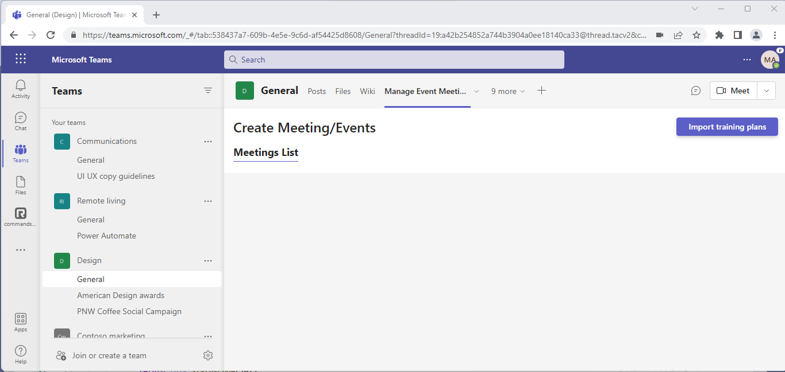

# This is a sample application which demonstrates how to create meeting in bulk on Teams calendar.

This is a sample application which demonstrates how to create meeting in bulk on Teams calendar use to create meeting to upload excel sheet.

## Interact with app.


## Prerequisites

- Microsoft Teams is installed and you have an account (not a guest account)
-  .[NET 6.0](https://dotnet.microsoft.com/en-us/download) SDK.
    ```bash
        # determine dotnet version
        dotnet --version
    ```
-  [ngrok](https://ngrok.com/) or equivalent tunneling solution
-  [M365 developer account](https://docs.microsoft.com/en-us/microsoftteams/platform/concepts/build-and-test/prepare-your-o365-tenant) or access to a Teams account with the appropriate permissions to install an app.

## Setup

Note these instructions are for running the sample on your local machine, the tunnelling solution is required because the Teams service needs to call into the bot.

1.Run ngrok - point to port 3978

 ```bash
    ngrok http --host-header=rewrite 3978
    ```

1) Setup for Bot

   In Azure portal, create a [Azure Bot resource](https://docs.microsoft.com/en-us/azure/bot-service/bot-service-quickstart-registration).
    - For bot handle, make up a name.
    - Select "Use existing app registration" (Create the app registration in Azure Active Directory beforehand.)
    - __*If you don't have an Azure account*__ create an [Azure free account here](https://azure.microsoft.com/en-us/free/)
    
   In the new Azure Bot resource in the Portal, 
    - Ensure that you've [enabled the Teams Channel](https://learn.microsoft.com/en-us/azure/bot-service/channel-connect-teams?view=azure-bot-service-4.0)
    - In Settings/Configuration/Messaging endpoint, enter the current `https` URL you were given by running ngrok. Append with the path `/api/messages`

## To try this sample

> Note these instructions are for running the sample on your local machine, the tunnelling solution is required because
> the Teams service needs to call into the app.

### 1. Clone the repository
   ```bash
   git clone https://github.com/OfficeDev/Microsoft-Teams-Samples.git
   ```

### 2. Launch Visual Studio
   - File -> Open -> Project/Solution
   - Navigate to folder where repository is cloned then `samples/EventMeeting/csharp/EventMeeting.sln`
    
### 3. Start ngrok on localhost:3978
- Open ngrok and run command `ngrok http -host-header=rewrite 3978` 
- Once started you should see link  `https://41ed-abcd-e125.ngrok.io`. Copy it, this is your baseUrl that will used as endpoint for Azure bot.


### 4. Update appsettings.json
Update configuration with the ```MicrosoftAppId```,  ```MicrosoftAppPassword``` and ```MicrosoftAppTenantId```.

### 5. Modify the `manifest.json` in the `/AppPackage` folder 
Replace the following details:
- `{{APP-ID}}` with any guid id value.
- `{{BASE-URL}}` with base Url domain. E.g. if you are using ngrok it would be `https://1234.ngrok.io` then your domain-name will be `1234.ngrok.io`.
- **Zip** up the contents of the `Manifest` folder to create a `manifest.zip`
- **Upload** the `manifest.zip` to Teams (in the Apps view click "Upload a custom app")

1) Navigate to **API Permissions**, and make sure to add the follow permissions:
-   Select Add a permission
-   Select Microsoft Graph -> Application permissions.
   - `Calendars.ReadWrite`
   - `Calendars.Read`

-   Click on Add permissions. Please make sure to grant the admin consent for the required permissions.

1).  Navigate to the **Certificates & secrets**. In the Client secrets section, click on "+ New client secret". Add a description (Name of the secret) for the secret and select “Never” for Expires. Click "Add". Once the client secret is created, copy its value, it need to be placed in the appsettings.json file.

## Running the sample

1. Here we can view a list of meettings and import the meetings.
  

2. Imported Meetings view from the excel sheet.
  

3. Dashborad of the Meetings Here is the all created meetings list.
   

4. Created Meeting view in teams.
   

## Further reading
- [Event resource type](https://docs.microsoft.com/en-us/graph/api/resources/event?view=graph-rest-1.0)