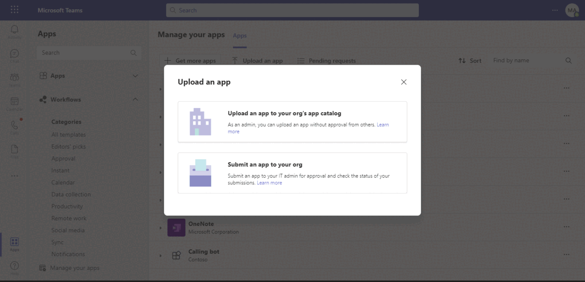
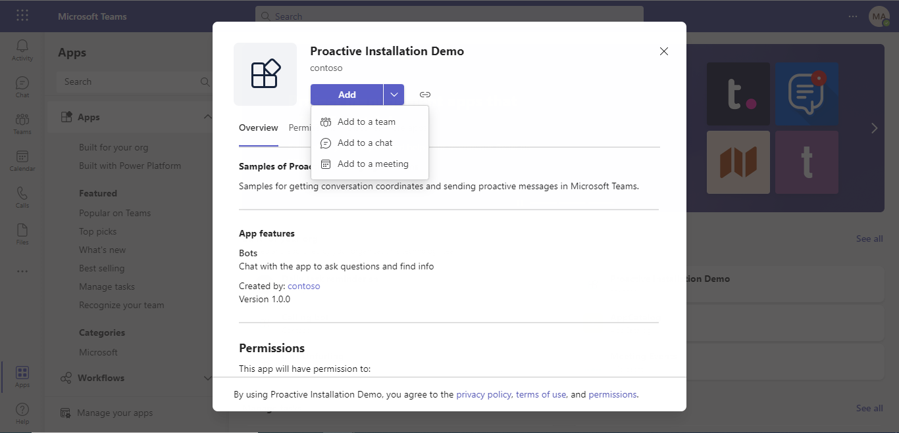
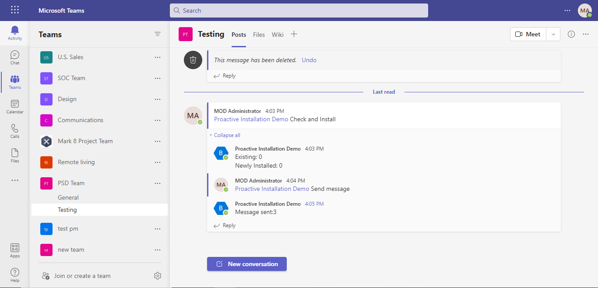

# Proactive Installation Sample App

This sample app illustrates the proactive installation of app using Graph API and sending proactive notification to users from GroupChat or Channel.

- **Interaction with bot**


## Try it yourself - experience the App in your Microsoft Teams client
Please find below demo manifest which is deployed on Microsoft Azure and you can try it yourself by uploading the app package (.zip file link below) to your teams and/or as a personal app. (Sideloading must be enabled for your tenant, [see steps here](https://docs.microsoft.com/microsoftteams/platform/concepts/build-and-test/prepare-your-o365-tenant#enable-custom-teams-apps-and-turn-on-custom-app-uploading)).

**Proactive Installation Sample App:** [Manifest](/samples/graph-proactive-installation/csharp/demo-manifest/graph-proactive-installation.zip)

## Prerequisites
- Microsoft Teams is installed and you have an account
- [NodeJS](https://nodejs.org/en/) version 10.14 or higher

    ```bash
    # determine node version
    node --version
- [ngrok](https://ngrok.com/) or equivalent tunnelling solution


## Register Azure AD application
Register one Azure AD application in your tenant's directory for the bot and tab app authentication.

1.  Log in to the Azure portal from your subscription, and go to the "App registrations" blade  [here](https://portal.azure.com/#blade/Microsoft_AAD_IAM/ActiveDirectoryMenuBlade/RegisteredApps). Ensure that you use a tenant where admin consent for API permissions can be provided.

2.  Click on "New registration", and create an Azure AD application.

3.  **Name:**  The name of your Teams app - if you are following the template for a default deployment, we recommend "App catalog lifecycle".

4.  **Supported account types:**  Select "Accounts in any organizational directory"

5.  Leave the "Redirect URL" field blank.   

6.  Click on the "Register" button.

7.  When the app is registered, you'll be taken to the app's "Overview" page. Copy the  **Application (client) ID**; we will need it later. Verify that the "Supported account types" is set to **Multiple organizations**.

8.  On the side rail in the Manage section, navigate to the "Certificates & secrets" section. In the Client secrets section, click on "+ New client secret". Add a description for the secret and select Expires as "Never". Click "Add".

9.  Once the client secret is created, copy its **Value**, please take a note of the secret as it will be required later.


At this point you have 3 unique values:
-   Application (client) ID which will be later used during Azure bot creation
-   Client secret for the bot which will be later used during Azure bot creation
-   Directory (tenant) ID


We recommend that you copy these values into a text file, using an application like Notepad. We will need these values later.

10.  Under left menu, navigate to **API Permissions**, and make sure to add the following permissions of Microsoft Graph API > Application permissions:
-   TeamsAppInstallation.ReadWriteForUser.All

Click on Add Permissions to commit your changes.

11.  If you are logged in as the Global Administrator, click on the "Grant admin consent for <%tenant-name%>" button to grant admin consent else, inform your admin to do the same through the portal or follow the steps provided here to create a link and send it to your admin for consent.
    
12.  Global Administrator can grant consent using following link:  [https://login.microsoftonline.com/common/adminconsent?client_id=](https://login.microsoftonline.com/common/adminconsent?client_id=)<%appId%> 

## Setup Bot Service

1. In Azure portal, create a [Azure Bot resource](https://docs.microsoft.com/azure/bot-service/bot-service-quickstart-registration)
2. Select Type of App as "Multi Tenant"
3.  Select Creation type as "Use existing app registration"
4. Use the copied App Id and Client secret from above step and fill in App Id and App secret respectively.
5. Click on 'Create' on the Azure bot.   
6. Go to the created resource, ensure that you've [enabled the Teams Channel](https://learn.microsoft.com/azure/bot-service/channel-connect-teams?view=azure-bot-service-4.0)
7. In Settings/Configuration/Messaging endpoint, enter the current `https` URL you have given by running ngrok. Append with the path `/api/messages`

###  Setup NGROK
1) Run ngrok - point to port 3978

```bash
# ngrok http -host-header=rewrite 3978
```

## Setup the Code
> Note these instructions are for running the sample on your local machine, the tunnelling solution is required because
the Teams service needs to call into the bot.

1) Clone the repository

    ```bash
    git clone https://github.com/OfficeDev/Microsoft-Teams-Samples.git
    ```

2) In a terminal, navigate to `samples/javascript_nodejs/graph-proactive-installation`
    ```bash
    cd samples/graph-proactive-installation/nodejs
    ```
3)  Install modules

    ```bash
    npm install
    ```

4) Go to .env file  and add `MicrosoftAppId` ,  `MicrosoftAppPassword` and `AppCatalogTeamAppId` information. 
    - To get `AppCatalogTeamAppId` navigate to following link in your browser [Get TeamsAppCatalogId](https://developer.microsoft.com/graph/graph-explorer?request=appCatalogs%2FteamsApps%3F%24filter%3DdistributionMethod%20eq%20'organization'&method=GET&version=v1.0&GraphUrl=https://graph.microsoft.com) from Microsoft Graph explorer.
    And then search with app name or based on Manifest App id in Graph Explorer response and copy the `Id` [i.e teamApp.Id]
    

5) Run your bot at the command line

    ```bash
    npm start
    ```

## Upload the Manifest
    - **Edit** the `manifest.json` contained in the  `TeamsAppManifest` folder to replace your Microsoft App Id (that was created when you registered your bot earlier) *everywhere* you see the place holder string `<<YOUR-MICROSOFT-APP-ID>>` (depending on the scenario the Microsoft App Id may occur multiple times in the `manifest.json`)
    - **Zip** up the contents of the `TeamsAppManifest` folder to create a `manifest.zip` (Make sure that zip file does not contains any subfolder otherwise you will get error while uploading your .zip package)
    - **Upload** the `manifest.zip` to Teams (In Teams Apps/Manage your apps click "Upload an app". Browse to and Open the .zip file. At the next dialog, click the Add button.)
    - Add the app to team/groupChat scope (Supported scopes)


## Running the sample
- Install the Proactive App Installation demo app in a Team or GroupChat.
    

- **Team Scope**: Run 'Check and Install' to pro-actively install the App for all the users in team. After installation send 'Send message' command to send proactive message.
    
- **Group Chat**:  Run 'Check and Install' to pro-actively install the App for all the users in team. After installation send 'Send message' command to send proactive message.
   

## Deploy the bot to Azure

To learn more about deploying a bot to Azure, see [Deploy your bot to Azure](https://aka.ms/azuredeployment) for a complete list of deployment instructions.

## Further Reading

- [Bot Framework Documentation](https://docs.botframework.com)
- [Bot Basics](https://docs.microsoft.com/azure/bot-service/bot-builder-basics?view=azure-bot-service-4.0)
- [Azure Bot Service Introduction](https://docs.microsoft.com/azure/bot-service/bot-service-overview-introduction?view=azure-bot-service-4.0)
- [Azure Bot Service Documentation](https://docs.microsoft.com/azure/bot-service/?view=azure-bot-service-4.0)
- [Proactive App Installation using Graph API](https://docs.microsoft.com/en-us/microsoftteams/platform/graph-api/proactive-bots-and-messages/graph-proactive-bots-and-messages?tabs=node)
