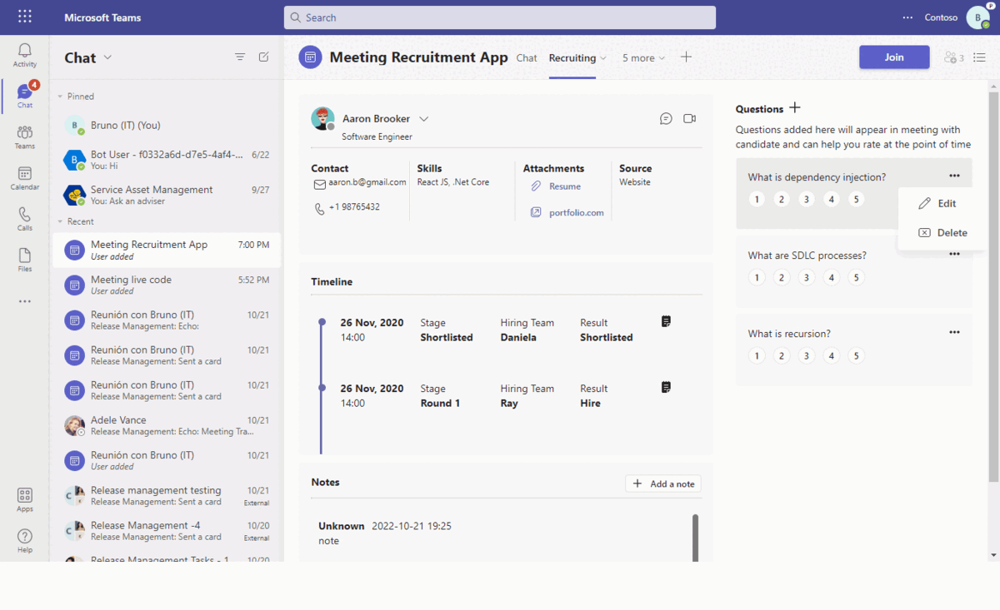
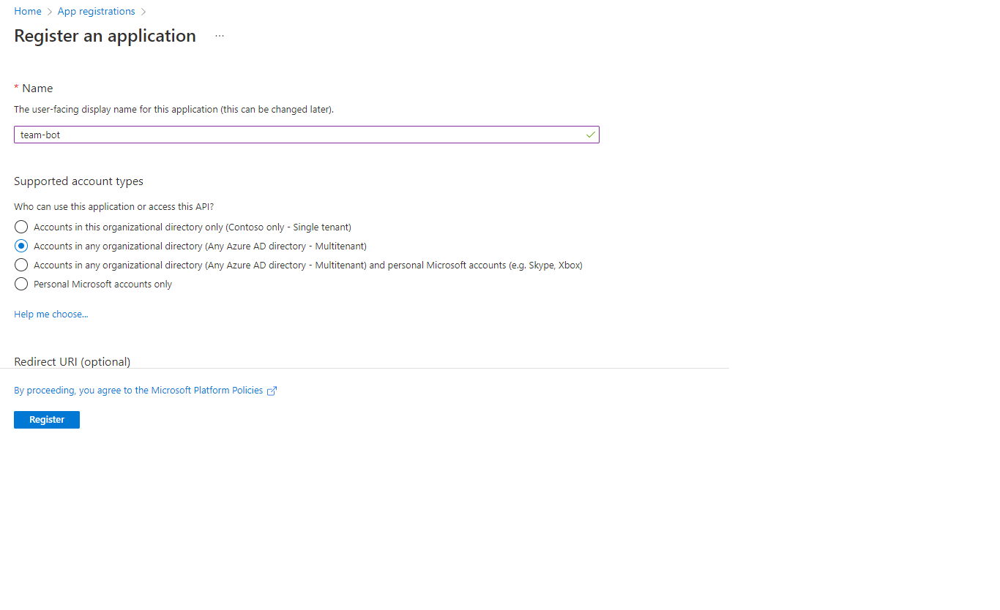
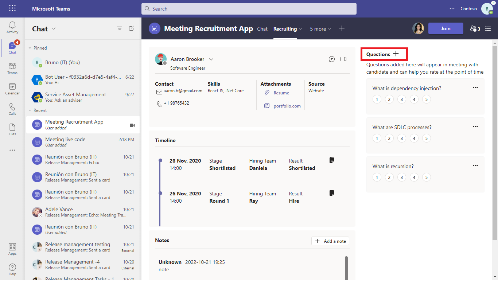
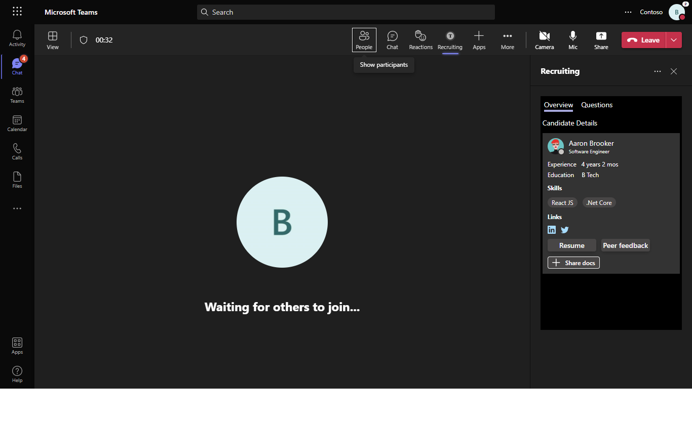
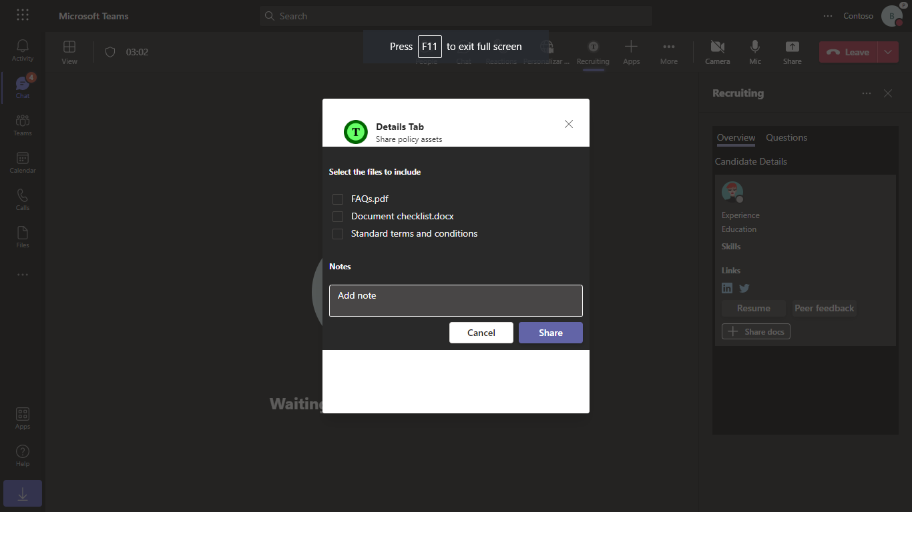
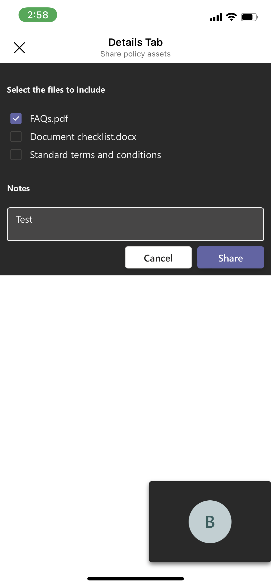

# Recruitment App Sample using Apps in Meetings

This sample illustrates a meeting experience for recruitment.

It has meeting details and in-meeting app that helps in the interview process.

## Interaction with app



## Prerequisites

- [.NET Core SDK](https://dotnet.microsoft.com/download) version 6.0

  ```bash
  # determine dotnet version
  dotnet --version
  ```
- [ngrok](https://ngrok.com/download) or equivalent tunnelling solution
- [Teams](https://teams.microsoft.com) Microsoft Teams is installed and you have an account

## Setup

1.Register a new application in the [Azure Active Directory – App Registrations](https://go.microsoft.com/fwlink/?linkid=2083908) portal.
   Fill out name and select third option for supported account type and click "Register".

   

   * Copy and paste the App Id and Tenant ID somewhere safe. You will need it in a future step.

  - Create Client Secret.
   * Navigate to the "Certificates & secrets" blade and add a client secret by clicking "New Client Secret".

    

   * Copy and paste the secret somewhere safe. You will need it in a future step.
   
2. Setup for Bot

    - Also, register a bot with Azure Bot Service, following the instructions [here](https://docs.microsoft.com/en-us/azure/bot-service/bot-service-quickstart-registration?view=azure-bot-service-3.0).
  - Ensure that you've [enabled the Teams Channel](https://docs.microsoft.com/en-us/azure/bot-service/channel-connect-teams?view=azure-bot-service-4.0)
  - While registering the bot, use `https://<your_ngrok_url>/api/messages` as the messaging endpoint.

      > NOTE: When you create your app registration, you will create an App ID and App password - make sure you keep these for later.
      
3. Create a Azure Storage account(This is needed to store/retrieve data that's used in the app) 
     [Create storage account](https://docs.microsoft.com/en-us/azure/storage/common/storage-account-create?tabs=azure-portal)

      This step will create a storage account. You will require storage account name and keys in next steps.
  
      Please follow [View account keys](https://docs.microsoft.com/en-us/azure/storage/common/storage-account-keys-manage?tabs=azure-portal#view-account-access-keys)  to see the keys info. 
     

4. Setup NGROK
     - Run ngrok - point to port 3978

    ```bash
     ngrok http -host-header=rewrite 3978
    ```

5. Setup for code

  - Clone the repository

      ```bash
      git clone https://github.com/OfficeDev/Microsoft-Teams-Samples.git
      ```

- Modify the `/appsettings.json` and fill in the following details:
    - `{{MicrosoftAppId}}` - Generated from Step 1 while doing AAd app registration in Azure portal.
    - `{{ MicrosoftAppPassword}}` - Generated from Step 1, also referred to as Client secret
    - `{{ StorageConnectionString }}` - Generated from Step 3,Create a Azure Storage accoun

 - Run the app from a terminal or from Visual Studio, choose option A or B.

     A) From a terminal

    ```bash
    # run the app
    dotnet run
    ```

    B) Or from Visual Studio

    - Launch Visual Studio
    - File -> Open -> Project/Solution
    - Navigate to `MeetingApp` folder
    - Select `MeetingApp.csproj` file
    - Press `F5` to run the project

6. Setup Manifest for Teams
- __*This step is specific to Teams.*__
    - **Edit** the `manifest.json` contained in the ./AppPackage folder to replace your Microsoft App Id (that was created when you registered your app registration earlier) *everywhere* you see the place holder string `<<APP-ID>>` (depending on the scenario the Microsoft App Id may occur multiple times in the `manifest.json`)
    - **Edit** the `manifest.json` for `<<BASE-URL>>` and replace `<<BASE-URL>>` with base Url of your domain. E.g. if you are using ngrok it would be `https://1234.ngrok.io` then your domain-name will be `1234.ngrok.io`.
    - **Zip** up the contents of the `AppPackage` folder to create a `manifest.zip` (Make sure that zip file does not contains any subfolder otherwise you will get error while uploading your .zip package)    
    
- Upload the manifest.zip to Teams (in the Apps view click "Upload a custom app")
   - Go to Microsoft Teams. From the lower left corner, select Apps
   - From the lower left corner, choose Upload a custom App
   - Go to your project directory, the ./AppPackage folder, select the zip folder, and choose Open.
   - Select Add in the pop-up dialog box. Your app is uploaded to Teams.


## Running the sample

1) Details page:
   The details page shows basic information of the candidate, timeline, Questions (that can be added for meeting), Notes (provided by peers)

   

2) Action on Questions:
   
   - The interviewer can Add/Edit or Delete question.

   

   - Add Questions Task Module
   
   

   

   - Edit Question Task Module
   
   

3) Add Notes:
   
   The interviewer can add notes that will appear to other peers.

   

   Add Note Task Module
  
   

4) Sidepanel:
    
    The in-meeting side panel shows two sections as follows:
    
    A) Overview: Shows the basic details of the candidate.
    
    B) Questions: The questions set in the details page appear here. The interviewer can use this to provide rating and submit final feedback.

    

    

5) Share assets:

   This is used to share assets to the candidate.
   
   

6) Mobile view: Details tab

   

   

   
   
   - Sidepanel view
   
   

   


## Further reading

- [Bot Framework Documentation](https://docs.botframework.com)
- [Bot Basics](https://docs.microsoft.com/azure/bot-service/bot-builder-basics?view=azure-bot-service-4.0)
- [Activity processing](https://docs.microsoft.com/en-us/azure/bot-service/bot-builder-concept-activity-processing?view=azure-bot-service-4.0)
- [Azure Bot Service Introduction](https://docs.microsoft.com/azure/bot-service/bot-service-overview-introduction?view=azure-bot-service-4.0)
- [Azure Bot Service Documentation](https://docs.microsoft.com/azure/bot-service/?view=azure-bot-service-4.0)
- [.NET Core CLI tools](https://docs.microsoft.com/en-us/dotnet/core/tools/?tabs=netcore2x)
- [Azure CLI](https://docs.microsoft.com/cli/azure/?view=azure-cli-latest)
- [Azure Portal](https://portal.azure.com)
- [Language Understanding using LUIS](https://docs.microsoft.com/en-us/azure/cognitive-services/luis/)
- [Channels and Bot Connector Service](https://docs.microsoft.com/en-us/azure/bot-service/bot-concepts?view=azure-bot-service-4.0)
