# Meeting Tabs Sample

This sample shows app stage view, Mute/Unmute Teams meeting audio call and Side panel.

**Interaction with bot**
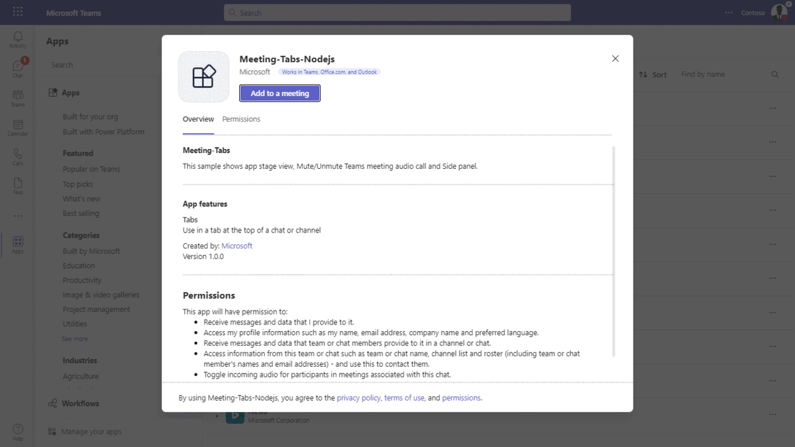

## Try it yourself - experience the App in your Microsoft Teams client
Please find below demo manifest which is deployed on Microsoft Azure and you can try it yourself by uploading the app package (.zip file link below) to your teams and/or as a personal app. (Sideloading must be enabled for your tenant, [see steps here](https://docs.microsoft.com/microsoftteams/platform/concepts/build-and-test/prepare-your-o365-tenant#enable-custom-teams-apps-and-turn-on-custom-app-uploading)).

**Meeting-Tabs:** [Manifest](/samples/meeting-tabs/nodejs/demo-manifest/meeting-tabs.zip)

## Prerequisites

- [nodejs](https://nodejs.org/en/)
- [ngrok](https://ngrok.com/) or equivalent tunnelling solution

## Setup

> Note these instructions are for running the sample on your local machine.

1. Run ngrok - point to port 3978

   ```bash
     ngrok http -host-header=rewrite 3978
   ```  

2. Setup

 **Register your application with Azure AD:**

  - Register a new application in the [Azure Active Directory – App Registrations](https://go.microsoft.com/fwlink/?linkid=2083908) portal.

  - On the overview page, copy and save the **Application (client) ID, Directory (tenant) ID**. You’ll need those later when updating your Teams application manifest and in the appsettings.json.

  - Ensure that you've [enabled the Teams Channel](https://docs.microsoft.com/en-us/azure/bot-service/channel-connect-teams?view=azure-bot-service-4.0)

3. Clone the repository

  ```bash
  git clone https://github.com/OfficeDev/Microsoft-Teams-Samples.git
  ```

4. In the folder where repository is cloned navigate to `samples/meeting-tabs/nodejs`

5. Install node modules

  Inside node js folder, open your local terminal and run the below command to install node modules. You can do the same in Visual Studio code terminal by opening the project in Visual Studio code.

  ```bash
  npm install
  ```

6. Update the `.env` with `PORT=3978`

7. Run your app

    ```bash
    npm start
    ```

 8. __*This step is specific to Teams.*__

- **Edit** the `manifest.json` contained in the  `teamsAppManifest` folder to replace your Microsoft App Id (that was created when you registered your bot earlier) *everywhere* you see the place holder string `<<YOUR-MICROSOFT-APP-ID>>` (depending on the scenario the Microsoft App Id may occur multiple times in the `manifest.json`)

- **Edit** the `manifest.json` for `<<DOMAIN-NAME>>` with base Url domain. E.g. if you are using ngrok it would be `https://1234.ngrok.io` then your domain-name will be `1234.ngrok.io`.

- **Zip** up the contents of the `teamsAppManifest` folder to create a `manifest.zip` (Make sure that zip file does not contains any subfolder otherwise you will get error while uploading your .zip package)

- **Upload** the `manifest.zip` to Teams (In Teams Apps/Manage your apps click "Upload an app". Browse to and Open the .zip file. At the next dialog, click the Add button.)

- Add the app to team/groupChat scope (Supported scopes). 

## Running the sample

You can interact with Teams Tab meeting sidepanel.

1. **Install app**
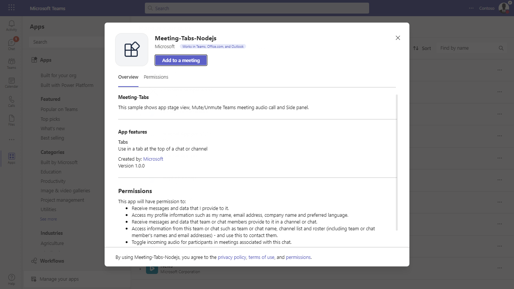

2. **Type a meeting name**
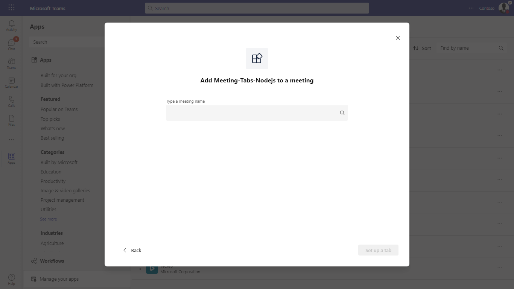

3. **Select meeting name**
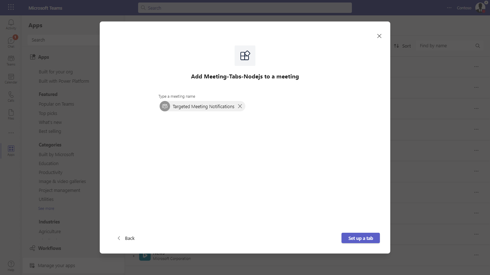

4. **Add meeting tab**
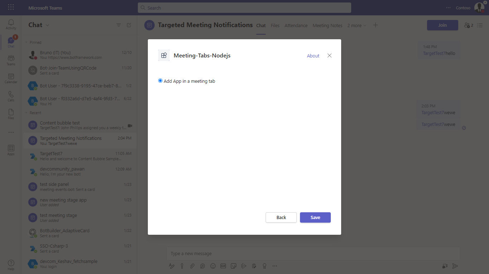

5. **Join meeting**
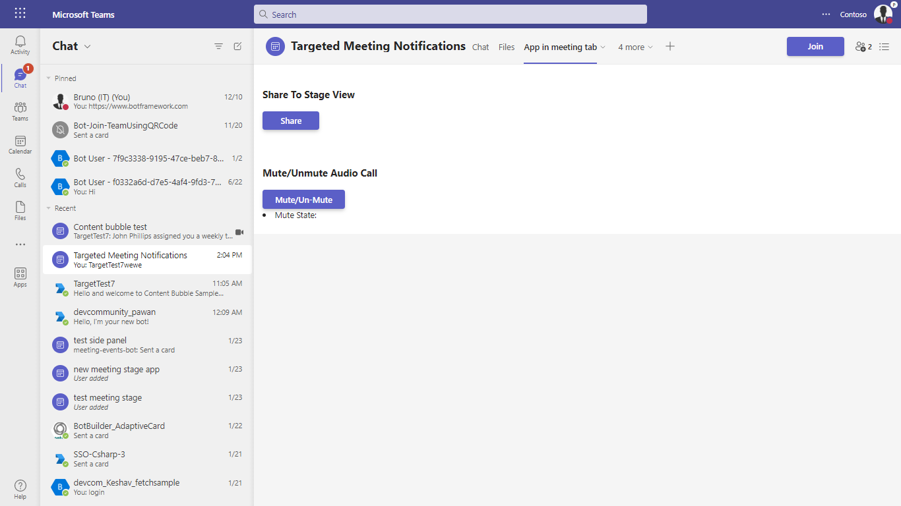

6. **Select your app**
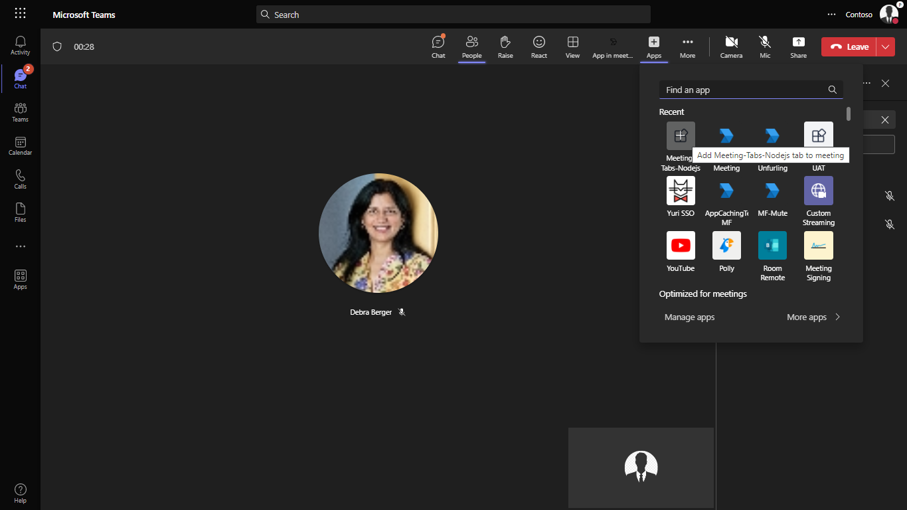

7. **Add meeting tab**
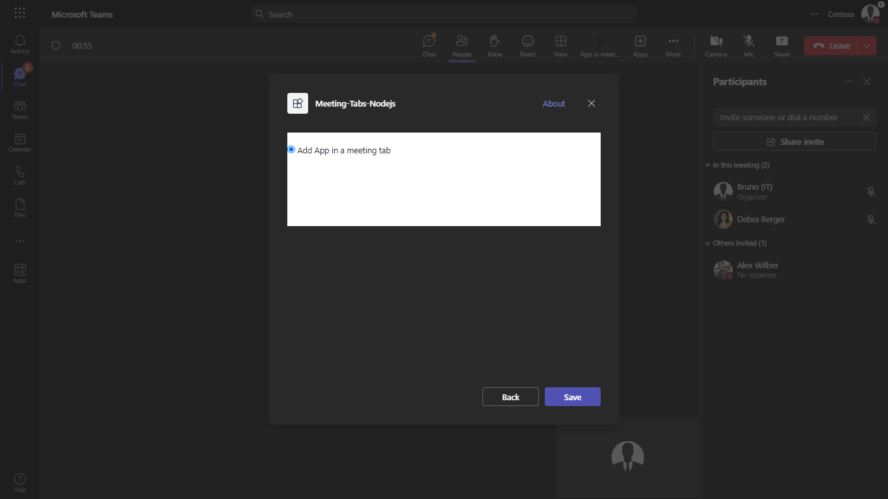

8. **Home page**
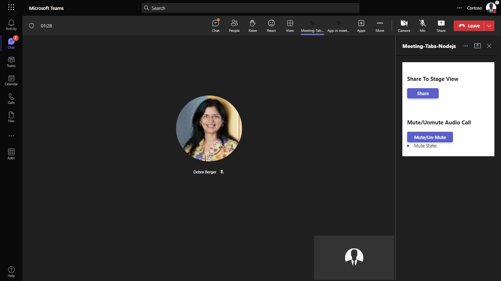

9. **Click share To stage view**
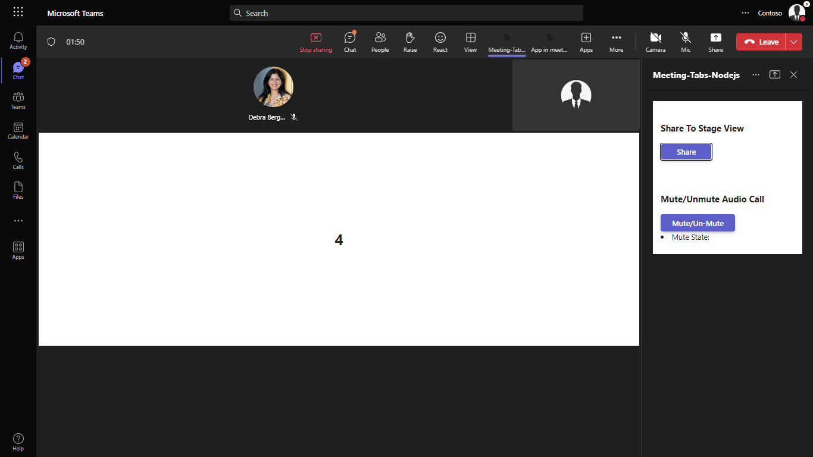

10. **Share To stage view**
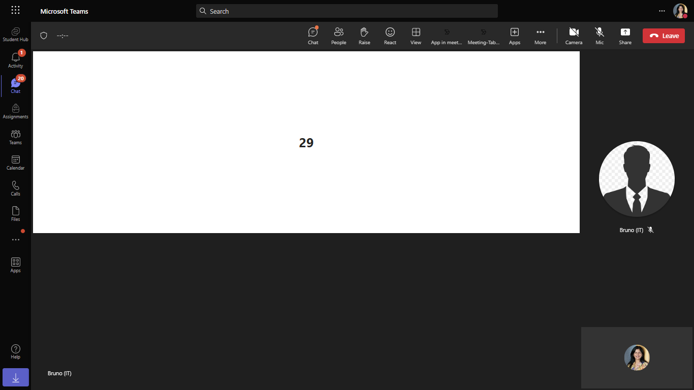

11. **Toggle To Mute**
Toggle button to mute state its looks like below.


12. **Toggle To Unmute**
Toggle button to Unmute state it will unmute client audio.


## Further reading

- [Toggle incoming audio](https://docs.microsoft.com/en-us/microsoftteams/platform/apps-in-teams-meetings/api-references?tabs=dotnet#toggle-incoming-audio)
- [Get incoming audio speaker](https://docs.microsoft.com/en-us/microsoftteams/platform/apps-in-teams-meetings/api-references?tabs=dotnet#get-incoming-audio-speaker)
- [Generate meeting side panel](https://learn.microsoft.com/en-us/microsoftteams/platform/sbs-meetings-sidepanel?tabs=vs)

