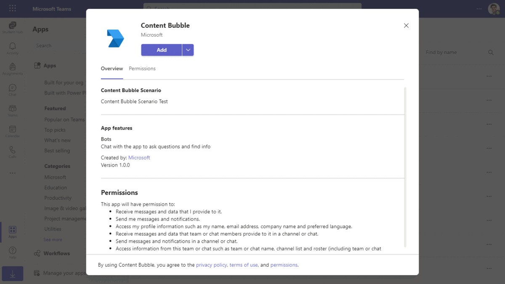
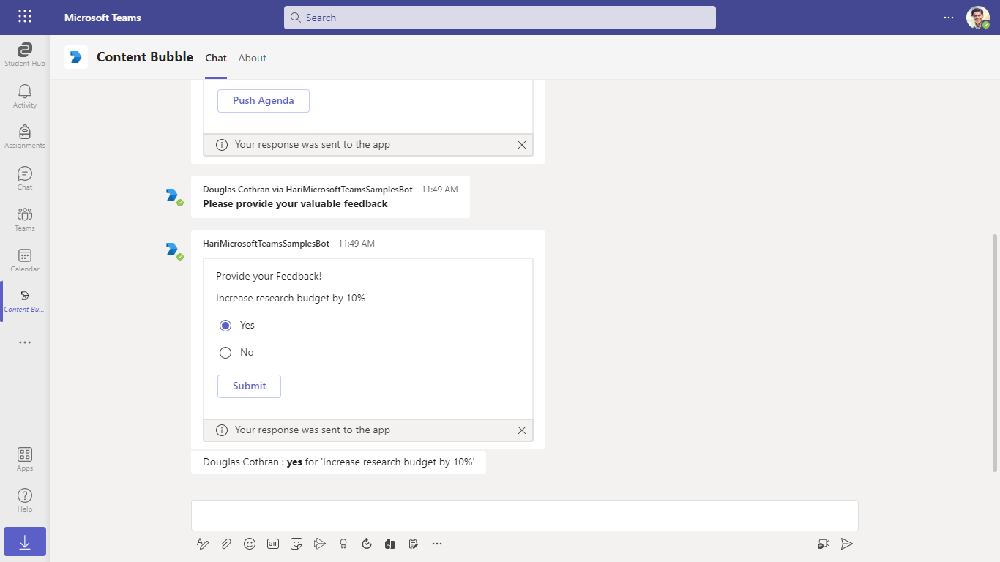
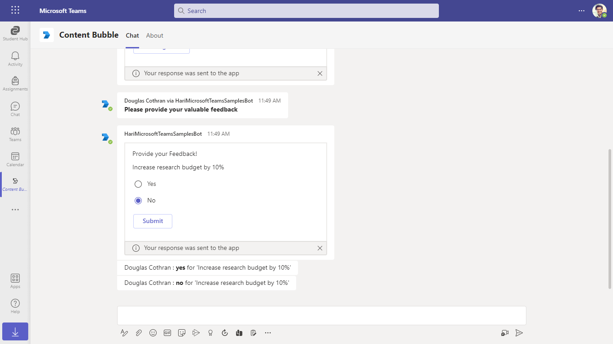

# Meetings Content Bubble

This sample illustrates how to implement [Content Bubble](https://docs.microsoft.com/en-us/microsoftteams/platform/apps-in-teams-meetings/create-apps-for-teams-meetings?view=msteams-client-js-latest&tabs=dotnet#notificationsignal-api) In-Meeting Experience.

# Feature of the sample



## Prerequisites

- [Node.js](https://nodejs.org) version 10.14 or higher

    ```bash
    # determine node version
    node --version
    ```

## To try this sample

- Clone the repository

    ```bash
    git clone https://github.com/OfficeDev/Microsoft-Teams-Samples.git
    ```

- In a terminal, navigate to `samples\meetings-content-bubble\nodejs`

    ```bash
    cd samples/meetings-content-bubble/nodejs
    ```

- Install modules

    ```bash
    npm install
    ```

- Start the bot

    ```bash
    npm start
    ```

1) Create a new Bot by following steps mentioned in [Build a bot](https://docs.microsoft.com/en-us/microsoftteams/platform/bots/what-are-bots?view=msteams-client-js-latest#build--a-bot-for-teams-with-the-microsoft-bot-framework) documentation.

- Ensure that you've [enabled the Teams Channel](https://docs.microsoft.com/en-us/azure/bot-service/channel-connect-teams?view=azure-bot-service-4.0)

2) Go to appsettings.json and add `MicrosoftAppId`, `MicrosoftAppPassword` and `BaseUrl` information.
3) Update the manifest.json file with MICROSOFT-APP-ID value.
4) You need to set the `externalResourceUrl` in notification payload to load the content bubble page in-meeting pop up
 ```
 notification: {
          alertInMeeting: true,
          externalResourceUrl: 'https://teams.microsoft.com/l/bubble/<<APP_ID>>?url=<<ENDPOINT_URL>>&height=270&width=300&title=ContentBubbleinTeams&completionBotId=<<APP_ID>>'
        }
 ```
6) [Install the App in Teams Meeting](https://docs.microsoft.com/en-us/microsoftteams/platform/apps-in-teams-meetings/teams-apps-in-meetings?view=msteams-client-js-latest#meeting-lifecycle-scenarios)






## Interacting with the app in Teams Meeting

Message the Bot by @ mentioning to interact with the content bubble.
1. You will see agenda items listed in an Adaptive Card.
2. Select any option and click on Push Agenda button
3. You can submit your feedback on either Content Bubble/Adaptive card sent in chat.
