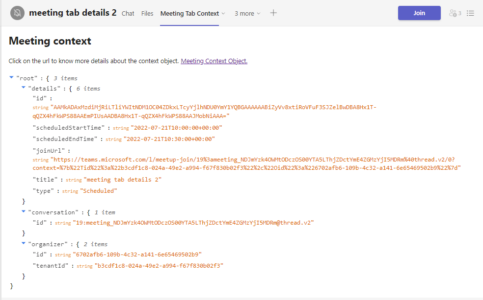

# Meeting context

This sample shows the contents of meeting tab context object in a meeting tab and shows the output of Meeting's API `TeamsInfo.getMeetingParticipant` and `TeamsInfo.getMeetingInfo` using bot commands.



  

## Prerequisites

- [NodeJS](https://nodejs.org/en/)
- [ngrok](https://ngrok.com/) or equivalent tunnelling solution

### Setup for Bot
Register your application with Azure AD

- Register a new application in the [Azure Active Directory – App Registrations](https://go.microsoft.com/fwlink/?linkid=2083908) portal.
- On the overview page, copy and save the **Application (client) ID, Directory (tenant) ID**. You’ll need those later when updating your Teams application manifest and in the appsettings.json.
-  Navigate to the **Certificates & secrets**. In the Client secrets section, click on "+ New client secret". Add a description (Name of the secret) for the secret and select “Never” for Expires. Click "Add". Once the client secret is created, copy its value, it need to be placed in the .env file.

In Azure portal, create a [Azure Bot resource](https://docs.microsoft.com/en-us/azure/bot-service/bot-builder-authentication?view=azure-bot-service-4.0&tabs=csharp%2Caadv2).

- Ensure that you've [enabled the Teams Channel](https://docs.microsoft.com/en-us/azure/bot-service/channel-connect-teams?view=azure-bot-service-4.0)

### To try this sample
1) Clone the repository

    ```bash
    git clone https://github.com/OfficeDev/Microsoft-Teams-Samples.git
    ```

2) In the folder where repository is cloned navigate to `samples/meetings-context-app/nodejs`

3) Run ngrok - point to port 3978

    ```bash
    ngrok http -host-header=rewrite 3978
    ```
4) Update the `.env`

   Update configuration with the ```MicrosoftAppId```,  ```MicrosoftAppPassword``` and ```MicrosoftAppTenantId```.

5) Install node modules and start server

   Inside node js folder, open your local terminal and run the below command to install node modules. You can do the same in Visual Studio code terminal by opening the project in Visual Studio code.

    ```bash
    npm install
    npm start
    ```
Your server will start running on 3000 PORT.

6) Install node modules and start client

   Navigate to folder `client` folder, open your local terminal and run the below command to install node modules. You can do the same in Visual Studio code terminal by opening the project in Visual Studio code.

    ```bash
    cd client
    npm install
    npm start
    ```
Your client will start running on 3978 PORT.

7) 6) Modify the `manifest.json` in the `/AppPackage` folder and replace the following details
   - `{{Manifest-id}}` with some unique GUID.
   - `{{Microsoft-App-Id}}`Registerd for app in step 1.
   - `{{Domain Name}}` with your application's base url, e.g. https://1234.ngrok.io
    - Zip up the contents of the `AppPackage/` folder to create a `manifest.zip`
    - Upload the `manifest.zip` to Teams (in the left-bottom *Apps* view, click "Upload a custom app")

8) Add the app in meeting.

 **NOTE:** Only accounts with admin access can create private/shared channels in team.

## Features of the sample

- Add the app in meeting.
- The details of the meeting context object will be shown on tab based.
- You can expand/reduce the JSON for the context object and can also copy a particular object slice.

- You can send one of these two commands: **Meeting Context** or **Participant Context**
- It will send you the output of `TeamsInfo.getMeetingInfo` and `TeamsInfo.getMeetingParticipant`

## Further reading

- [Tab Basics](https://docs.microsoft.com/en-us/microsoftteams/platform/tabs/how-to/create-channel-group-tab?pivots=node-java-script)
- [Azure Portal](https://portal.azure.com)
- [Get-context-for-tabs](https://docs.microsoft.com/en-us/microsoftteams/platform/tabs/how-to/access-teams-context#retrieve-context-in-private-channels)
- [Meeting API reference](https://docs.microsoft.com/en-us/microsoftteams/platform/apps-in-teams-meetings/api-references?tabs=dotnet)
