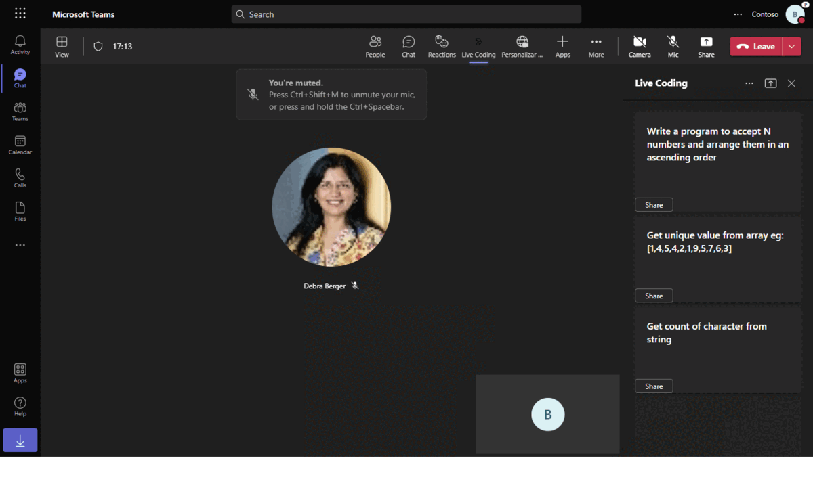
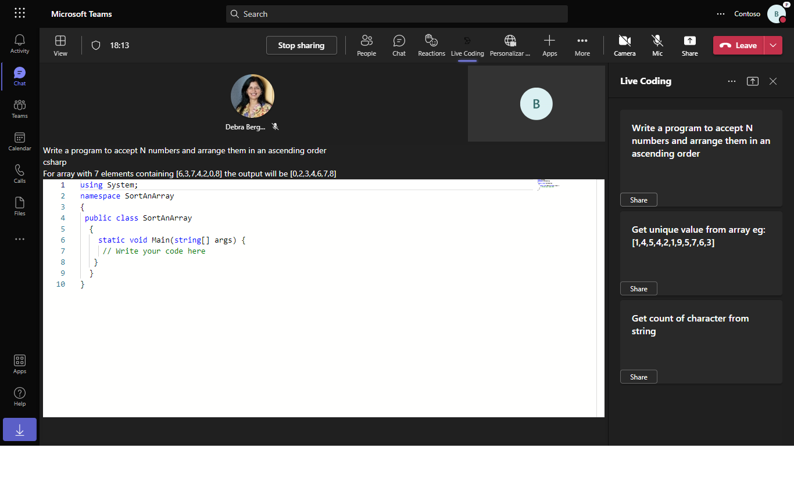
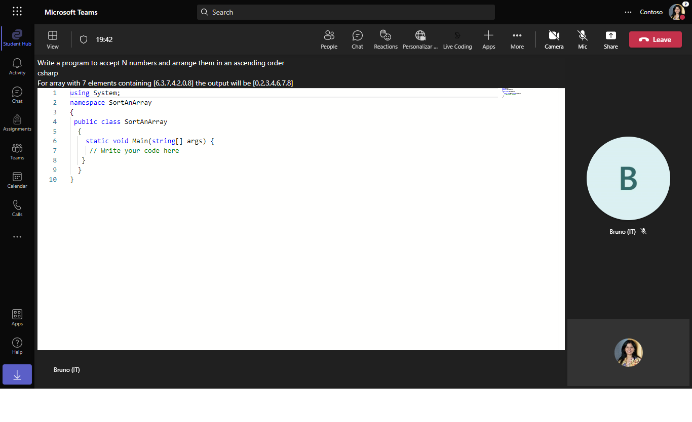

# Live coding interview using Shared meeting stage 

This sample demos a live coding in a Teams meeting stage using [Live Share SDK](https://aka.ms/livesharedocs). In side panel there is a list of question in specific coding language and on share click specific question with language code editor will be shared with other participant in meeting.
Now any participant in meeting can write code for the question and same will be updated to all the other participants in meeting.

## Interaction with app



## Try it yourself - experience the App in your Microsoft Teams client
Please find below demo manifest which is deployed on Microsoft Azure and you can try it yourself by uploading the app package (.zip file link below) to your teams and/or as a personal app. (Sideloading must be enabled for your tenant, [see steps here](https://docs.microsoft.com/microsoftteams/platform/concepts/build-and-test/prepare-your-o365-tenant#enable-custom-teams-apps-and-turn-on-custom-app-uploading)).

**Live coding interview using Shared meeting stage:** [Manifest](/samples/meetings-live-code-interview/csharp/demo-manifest/meetings-live-code-interview.zip)

## Prerequisites

- [.NET Core SDK](https://dotnet.microsoft.com/download) version 6.0

  ```bash
  # determine dotnet version
  dotnet --version
  ```
- [Ngrok](https://ngrok.com/download) (For local environment testing) Latest (any other tunneling software can also be used)
 - [Teams](https://teams.microsoft.com) Microsoft Teams is installed and you have an account.

## Workflow

```mermaid

sequenceDiagram

    Teams User->>+Teams Client: Schedules a Teams Meeting with candidate

    Teams Client->>+Live Coding App: Installs the App

    Teams User->>+Teams Client: Starts the meeting

    Teams User->>+Live Coding App: Opens the Live coding app side panel

    Live Coding App->>+Side Panel: Load questions

    Side Panel-->>-Live Coding App: Loads predefined coding questions

    Teams User->>+Side Panel: Select the coding question to share to stage

    Side Panel-->>-Teams Client: Tells the team client to open a code editor on the stage

    Teams Client->>+Code Editor Stage: Tells the app which coding question to open

    Code Editor Stage-->>-Live Coding App: Shares the question to share to stage in the meeting
   ```
    
## Setup


1. Register a new application in the [Azure Active Directory – App Registrations](https://go.microsoft.com/fwlink/?linkid=2083908) portal.

    > NOTE: When you create your app registration, you will create an App ID and App password - make sure you keep these for later.

2. Setup NGROK
   - Run ngrok - point to port 3978

  ```bash
   ngrok http -host-header=rewrite 3978
  ```

3. Setup for code

- Clone the repository

    ```bash
    git clone https://github.com/OfficeDev/Microsoft-Teams-Samples.git
    ```
    
     In a terminal, navigate to `samples/meeting-live-coding-interview/csharp`

    ```bash
    # change into project folder
    cd # MeetingLiveCoding
    
    Run the app from a terminal or from Visual Studio, choose option A or B.

  A) From a terminal

  ```bash
  # run the app
  dotnet run
  ```

  B) Or from Visual Studio

  - Launch Visual Studio
  - File -> Open -> Project/Solution
  - Navigate to `MeetingLiveCoding` folder
  - Select `MeetingLiveCoding.csproj` file
  - Press `F5` to run the project

- Inside ClientApp folder execute the below command.

    ```bash
    # npx @fluidframework/azure-local-service@latest
    ```
4. Setup Manifest for Teams
 - __*This step is specific to Teams.*__
    - **Edit** the `manifest.json` contained in the ./AppPackage folder to replace your Microsoft App Id (that was created when you registered your app registration earlier) *everywhere* you see the place holder string `{{Microsoft-App-Id}}` (depending on the scenario the Microsoft App Id may occur multiple times in the `manifest.json`)
    - **Edit** the `manifest.json` for `validDomains` and replace `{{domain-name}}` with base Url of your domain. E.g. if you are using ngrok it would be `https://1234.ngrok.io` then your domain-name will be `1234.ngrok.io`.
    - **Zip** up the contents of the `AppPackage` folder to create a `manifest.zip` (Make sure that zip file does not contains any subfolder otherwise you will get error while uploading your .zip package)

- Upload the manifest.zip to Teams (in the Apps view click "Upload a custom app")
   - Go to Microsoft Teams. From the lower left corner, select Apps
   - From the lower left corner, choose Upload a custom App
   - Go to your project directory, the ./AppPackage folder, select the zip folder, and choose Open.
   - Select Add in the pop-up dialog box. Your app is uploaded to Teams.


**Note** Run the app on desktop client with developer preview on.   

## Running the sample

**Side panel view:**


**Question view on click of share:**


**Question view for other participant in meeting:**


## Further reading

- [Share-app-content-to-stage-api ](https://docs.microsoft.com/en-us/microsoftteams/platform/apps-in-teams-meetings/api-references?tabs=dotnet#share-app-content-to-stage-api)
- [Enable-and-configure-your-app-for-teams-meetings](https://docs.microsoft.com/en-us/microsoftteams/platform/apps-in-teams-meetings/enable-and-configure-your-app-for-teams-meetings)
- [Live-share-sdk-overview](https://docs.microsoft.com/en-us/microsoftteams/platform/apps-in-teams-meetings/teams-live-share-overview)