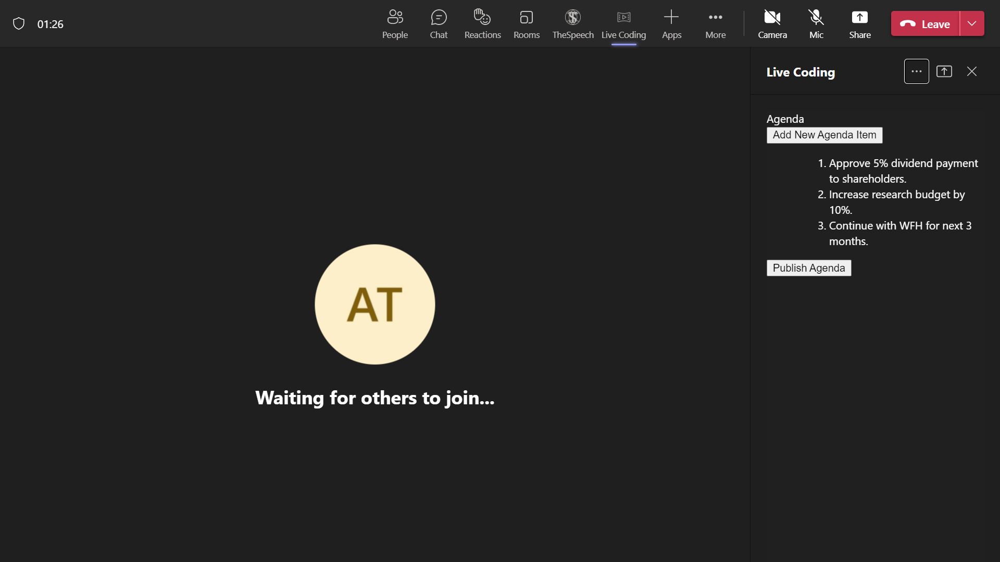
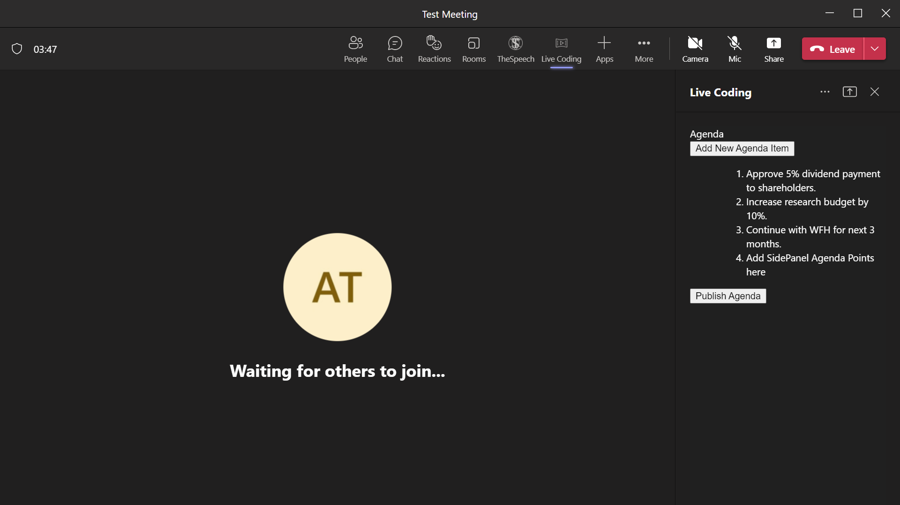
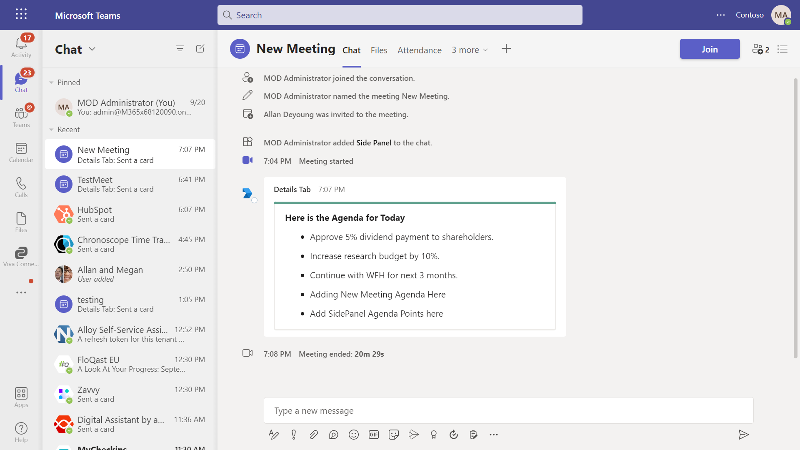

# Meetings SidePanel

This sample illustrates how to implement [Side Panel](https://docs.microsoft.com/en-us/microsoftteams/platform/apps-in-teams-meetings/create-apps-for-teams-meetings?view=msteams-client-js-latest&tabs=dotnet#notificationsignal-api) In-Meeting Experience.


  
### User interactions(Meeting Organizer)
- **Add New Agenda Item** - Gives provision to add new Agenda point.
- **Add** - Adds the agenda from Textinput to the SidePanel agenda list.
- **Publish Agenda** - Sends the agenda list to the meeting chat.

## Prerequisites

- [Node.js](https://nodejs.org) version 10.14 or higher

    ```bash
    # determine node version
    node --version
    ```
    
- [Teams](https://teams.microsoft.com) Microsoft Teams is installed and you have an account

- Register a bot with Azure Bot Service, following the instructions [here](https://docs.microsoft.com/en-us/azure/bot-service/bot-service-quickstart-registration?view=azure-bot-service-3.0).
- Ensure that you've [enabled the Teams Channel](https://docs.microsoft.com/en-us/azure/bot-service/channel-connect-teams?view=azure-bot-service-4.0)
- While registering the bot, use `https://<your_ngrok_url>/api/messages` as the messaging endpoint.
    > NOTE: When you create your bot you will create an App ID and App password - make sure you keep these for later.

1. Clone the repository
      ```bash
      git clone https://github.com/OfficeDev/Microsoft-Teams-Samples.git
      ```

2. Install node modules

   Inside node js folder,  navigate to `samples/meetings-sidepanel/nodejs/server` open your local terminal and run the below command to install node modules. You can do the same in Visual Studio code terminal by opening the project in Visual Studio code.

   - Repeat the same step in folder `samples/meetings-sidepanel/nodejs/ClientApp`

    ```bash
    npm install
    ```
3. We have two different solutions to run so follow below steps:
 
   A) In a terminal, navigate to `samples/meetings-sidepanel/nodejs/server`

   B) In a different terminal, navigate to `samples/meetings-sidepanel/nodejs/ClientApp`

4. Run ngrok - point to port 3001 (pointing to ClientApp)

    ```bash
    # ngrok http -host-header=rewrite 3001
    ```
5. Create a new Bot by following steps mentioned in [Build a bot](https://docs.microsoft.com/en-us/microsoftteams/platform/bots/what-are-bots?view=msteams-client-js-latest#build--a-bot-for-teams-with-the-microsoft-bot-framework) documentation.
6. Go to .env file  and add ```MicrosoftAppId``` and  ```MicrosoftAppPassword``` information.
7. Run your app, either from Visual Studio code  with ``` npm start``` or using ``` Run``` in the Terminal.
8. Update the manifest.json file with ```Microsoft-App-ID``` and ```BaseUrl``` value.
9. [Install the App in Teams Meeting](https://docs.microsoft.com/en-us/microsoftteams/platform/apps-in-teams-meetings/teams-apps-in-meetings?view=msteams-client-js-latest#meeting-lifecycle-scenarios)

## Interacting with the app in Teams Meeting
Interact with SidePanel by clicking on the App icon present on the top menu beside the "more actions" during a meeting.
1. Once the app is clicked, sidepanel appears with the default agenda list. Only organizer gets the feasibility to add new agenda points to the list using "Add New Agenda Item" button.



2. On click of "Add" button, agenda point will be added to the agenda list by organizer.

3. On click of "Publish Agenda", the agenda list will be sent to the meeting chat.

