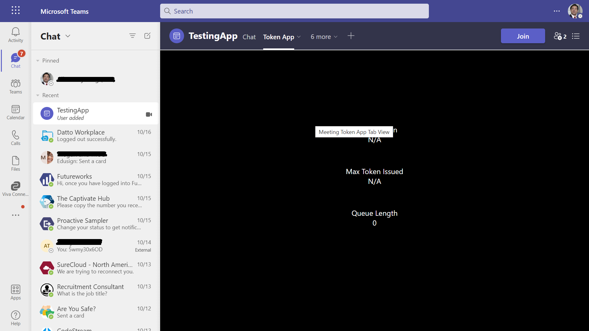
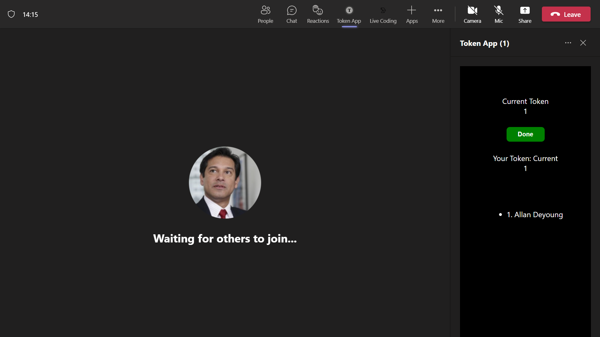

# Meeting Token Generator

The Meeting Token Generator app is a sample Microsoft Teams app that extends meetings in Teams.
Through this app, meeting participants can request a "token", which is generated sequentially so that each participant has a fair opportunity to interact. This can be useful in situations like scrum meetings, Q&A sessions, etc.
This application also shows the implementation of Live Share SDK to update the data in real-time for all participants in meeting.

- [Live-share-sdk-overview](https://docs.microsoft.com/en-us/microsoftteams/platform/apps-in-teams-meetings/teams-live-share-overview)

**NOTE: This capability is currently available in developer preview only.**

### Key features
 - Display the current token that is being serviced in the meeting
 - Display the user list sorted by the token number in ascending order
 - Generate a token for the user upon request
 - Display the current user's token number
 - Mark a token as done by the user
 - Skip the current token for the organizer of the meeting

 

 

 
  
### User interactions
- **Token** - Requests a token for the user
- **Done** - Acknowledges that the user is done with the token
- **Skip** - Skips the current user and moves on to the next person in line for a token. This button is only shown to users with the meeting Organizer role.

## Prerequisites

### Tools

- [.NET Core SDK](https://dotnet.microsoft.com/download) version 3.1
  ```bash
  # determine dotnet version
  dotnet --version
  ```

- [Nodejs](https://nodejs.org/en/download/) version 10.21.0+ (use the LTS version)
  ```bash
  # determine dotnet version
  node --version
  ```

- [Ngrok](https://ngrok.com/download) (Only for devbox testing) Latest (any other tunneling software can also be used)
  ```bash
  # run ngrok locally
  ngrok http -host-header=rewrite 3978
  ```

### Technologies

We assume working knowledge of the following technologies to gain full understanding of the app
- [C#](https://docs.microsoft.com/en-us/dotnet/csharp/tutorials/)
- [ECMAScript6](http://es6-features.org/)
- [Asp.NET core](https://docs.microsoft.com/en-us/aspnet/core/?view=aspnetcore-3.1) version 3.1
- [React.JS](https://reactjs.org/tutorial/tutorial.html) version 16+ 

The app uses the Teams extensibility features described on the following pages:
- [Apps in Teams meetings](https://docs.microsoft.com/en-us/microsoftteams/platform/apps-in-teams-meetings/teams-apps-in-meetings)
- [Create apps for Teams meetings](https://docs.microsoft.com/en-us/microsoftteams/platform/apps-in-teams-meetings/create-apps-for-teams-meetings?tabs=json)
- [Tab single sign-on](https://docs.microsoft.com/en-us/microsoftteams/platform/tabs/how-to/authentication/auth-aad-sso) to get the identity of the user accessing the tab, in a way that can be verified in the server APIs

## Running the sample

### Step 1: Register Azure AD applications
1. Start an ngrok session as indicated above. Note the ngrok domain, as you will use this in the registration steps below, where it will be the value of `WebAppDomain`.
1. Register your bot using bot channel registration in Azure AD portal, following the instructions [here](Wiki/azure-bot-channels-registration.md).
1. Update the AAD app registration for tab SSO, following the  instructions [here](Wiki/auth-aad-sso.md). The "fully qualified domain name" in the instructions will be your ngrok domain.
1. Set up the appsettings.json with the following keys:
    - `"MicrosoftAppId"`: Application (client) ID of the bot's Azure AD application
    - `"MicrosoftAppPassword"`: client secret of the bot's Azure AD application
    - `"AzureAd"."TenantId"`: Tenant ID of the tenant where the app will be used. Note that the sample will only work in this tenant.
    - `"AzureAd"."ApplicationId "`: Set to the same value as `MicrosoftAppId` above.
    - `"ContentBubbleUrl "`: Content bubble iframe url (default. `https://[WebAppDomain]/contentBubble.html`). Remember that `[WebAppDomain]` will be your ngrok domain, so the content bubble URL will be similar to `https://f631****.ngrok.io/contentBubble.html`.

2. Register a bot with Azure Bot Service, following the instructions [here](https://docs.microsoft.com/en-us/azure/bot-service/bot-service-quickstart-registration?view=azure-bot-service-3.0).
- Ensure that you've [enabled the Teams Channel](https://docs.microsoft.com/en-us/azure/bot-service/channel-connect-teams?view=azure-bot-service-4.0)
- While registering the bot, use `https://<your_ngrok_url>/api/messages` as the messaging endpoint.
    > NOTE: When you create your bot you will create an App ID and App password - make sure you keep these for later.
  
### Step 2: Add the following entry to the manifest.json ([schema reference](https://docs.microsoft.com/en-us/microsoftteams/platform/resources/schema/manifest-schema))
1. Set `manifestVersion` to "devPreview"
1. Add your bot configuration, with the app id of the bot generated from the previous steps
1. Fill-in the following `webApplicationInfo` section, using `MicrosoftAppId` and `WebAppDomain` values from the previous section.
    ```json
    "webApplicationInfo": {  
      "id": "[MicrosoftAppId]",  
      "resource": "api://[WebAppDomainName]/[MicrosoftAppId]"  
    }
    ```

### Step 3: Build the client app
1. Navigate to the `App` folder in a terminal
2. Run `npm install`
3. Run `npm run build` to build the app. 
  
  This generates the dist folder inside the app where the assets will generated/copied. The server will serve the static files from this location.

### Step 4: Inside ClientApp folder execute the below command.
    ```bash
    # npx @fluidframework/azure-local-service@latest
    ```

### Step 5: Build and run the service
You can build and run the project from the command line or an IDE:

A) From a command line:
  ```bash
  # run the server
  cd TokenApp
  dotnet run
  ```

B) From an IDE:
1. Launch Visual Studio
2. File > Open > Project/Solution
3. Navigate to the `TokenApp` folder
4. Select `TokenApp.csproj` file
5. Press `F5` to run the project

### Step 5: Enable developer preview in your desktop Teams client
Follow [these instructions](https://docs.microsoft.com/en-us/microsoftteams/platform/resources/dev-preview/developer-preview-intro#enable-developer-preview) to enable developer preview. Note that Developer preview mode must be enabled on each Teams client app or browser.

> In-meeting tabs are only available in the Teams desktop client. They will not be visible when you run Teams in a web browser.

### Step 6: Sideload the app in a Teams desktop client
1. Create a .zip using the below files, which are in the `Resources/Manifest` folder.
  - manifest.json
  - icon-outline.png
  - icon-color.png
1. Create a meeting with few test participants, ideally with a mix of Presenters and Attendees.
1. Once meeting is created, go to the meeting details page and click on the "Add tab" (+) button.
1. In the pop-up that opens, click on "Manage apps".
1. Click on "Upload a custom app" and upload the .zip file that was created in the previous steps. This adds the app to the meeting.
1. Click on the "Add tab" button again. Now in the app selection page, the app should be visible as a "Meeting optimized tab".
1. Select the Meeting Token app.
1. Now the app will be visible in the meeting chat.
1. Start the meeting and the icon should be visible in the meeting control bar.

## Troubleshooting
The sample app uses an in-memory store to maintain token information and the service URL for the tenant. If you restart the project, you must run the following command to recapture the service URL: `@[BotName] reset`

In your own projects, please use a durable storage mechanism to store the service URL for the tenant.

## Further reading

- [Teams Tabs experience](https://docs.microsoft.com/en-us/microsoftteams/platform/tabs/what-are-tabs)
- [Tabs SSO](https://docs.microsoft.com/en-us/microsoftteams/platform/tabs/how-to/authentication/auth-aad-sso)
- [Bot Framework Documentation](https://docs.botframework.com)
- [Bot Basics](https://docs.microsoft.com/azure/bot-service/bot-builder-basics?view=azure-bot-service-4.0)
- [Activity processing](https://docs.microsoft.com/en-us/azure/bot-service/bot-builder-concept-activity-processing?view=azure-bot-service-4.0)
- [Azure Bot Service Introduction](https://docs.microsoft.com/azure/bot-service/bot-service-overview-introduction?view=azure-bot-service-4.0)
- [Azure Bot Service Documentation](https://docs.microsoft.com/azure/bot-service/?view=azure-bot-service-4.0)
- [.NET Core CLI tools](https://docs.microsoft.com/en-us/dotnet/core/tools/?tabs=netcore2x)
- [Azure CLI](https://docs.microsoft.com/cli/azure/?view=azure-cli-latest)
- [Azure Portal](https://portal.azure.com)

# Contributing

This project welcomes contributions and suggestions.  Most contributions require you to agree to a
Contributor License Agreement (CLA) declaring that you have the right to, and actually do, grant us
the rights to use your contribution. For details, visit https://cla.opensource.microsoft.com.

When you submit a pull request, a CLA bot will automatically determine whether you need to provide
a CLA and decorate the PR appropriately (e.g., status check, comment). Simply follow the instructions
provided by the bot. You will only need to do this once across all repos using our CLA.

This project has adopted the [Microsoft Open Source Code of Conduct](https://opensource.microsoft.com/codeofconduct/).
For more information see the [Code of Conduct FAQ](https://opensource.microsoft.com/codeofconduct/faq/) or
contact [opencode@microsoft.com](mailto:opencode@microsoft.com) with any additional questions or comments.

