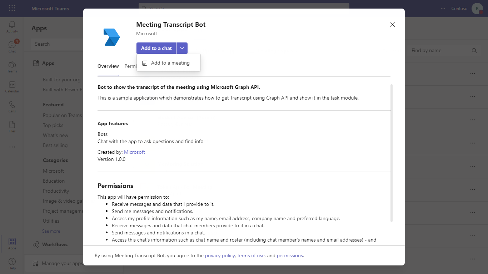
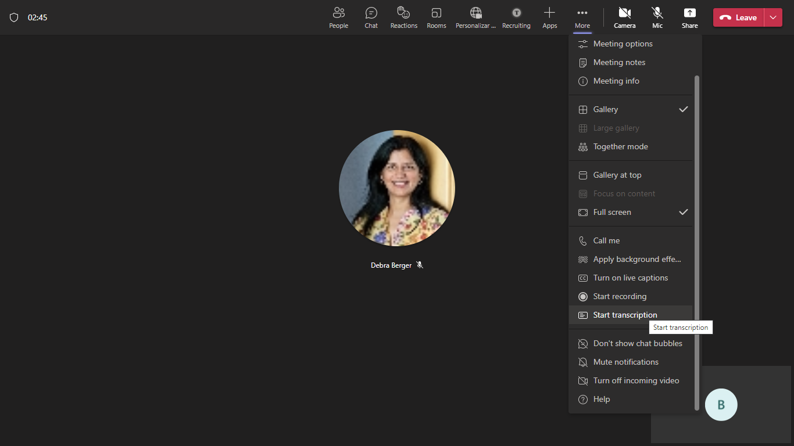
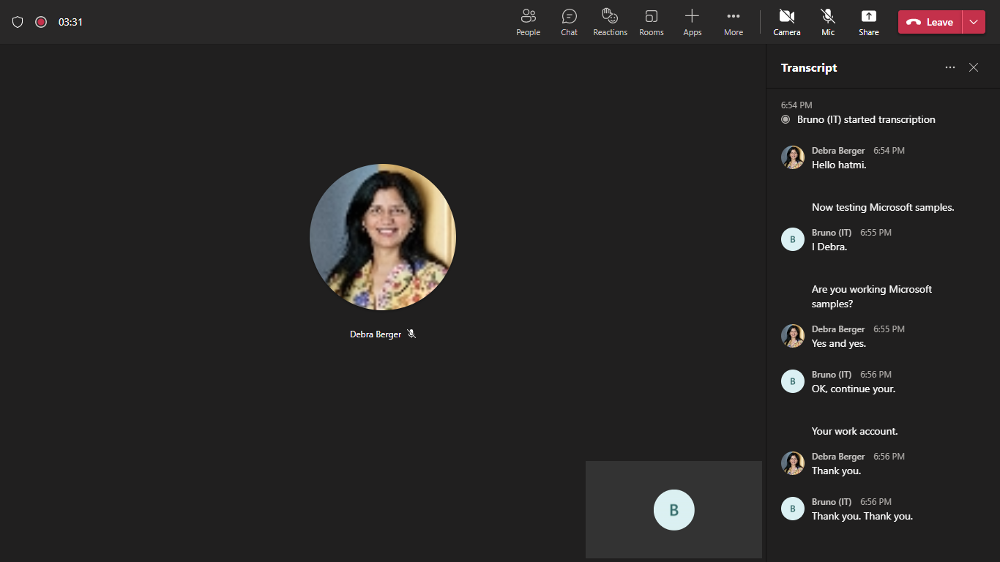
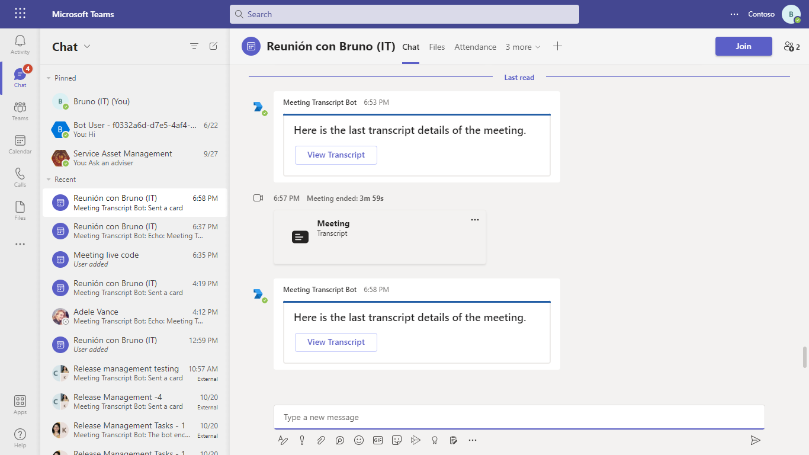
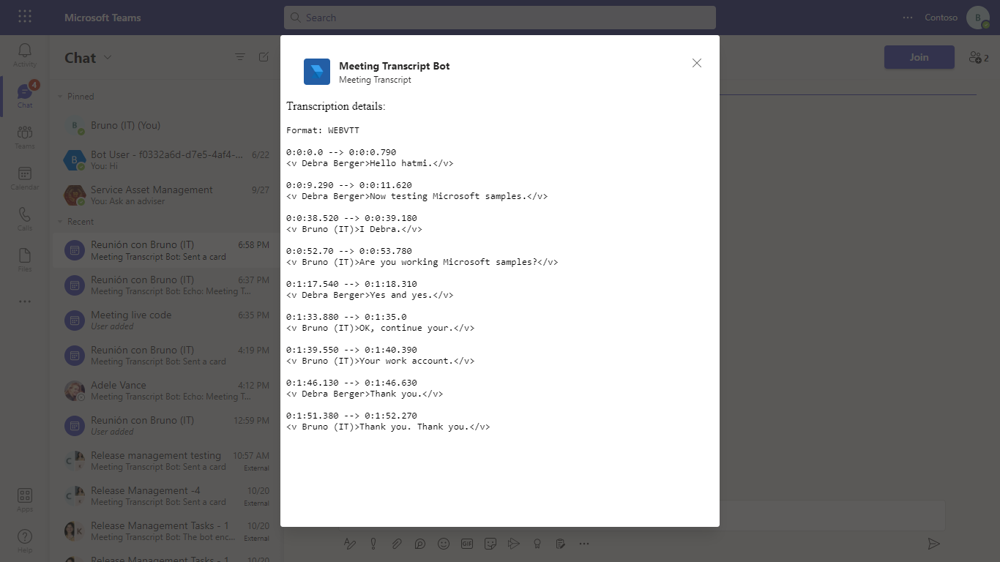

# Bot to show the transcript of the meeting using Microsoft Graph API.

This is a sample application which demonstrates how to get Transcript using Graph API and show it in the task module.

## Key features

1. Schedule the meeting and add Meeting Transcript Bot from `Apps` section in that particular scheduled meeting.

2. Once meeting started, start the Transcript for the meeting.

3. Once the transcription has started, you can see the live transcription it the meeting UI.

4. Once the Meeting ended, Meeting Transcript Bot will sent a card having a button to open task module.

5. After clicking on `View Transcript` button, you will see the recorded Transcript in the opened Task Module.


## Prerequisites

- Microsoft Teams is installed and you have an account (not a guest account)
-  .[NET 6.0](https://dotnet.microsoft.com/en-us/download) SDK.
    ```bash
        # determine dotnet version
        dotnet --version
    ```
-  [ngrok](https://ngrok.com/) or equivalent tunneling solution
-  [M365 developer account](https://docs.microsoft.com/en-us/microsoftteams/platform/concepts/build-and-test/prepare-your-o365-tenant) or access to a Teams account with the appropriate permissions to install an app.

## To try this sample

> Note these instructions are for running the sample on your local machine, the tunnelling solution is required because
> the Teams service needs to call into the bot.

### 1. Start ngrok on localhost:3978
- Open ngrok and run command `ngrok http -host-header=rewrite 3978` 
- Once started you should see URL  `https://41ed-abcd-e125.ngrok.io`. Copy it, this is your baseUrl that will used as endpoint for Azure bot and webhook.


### 2. Register Azure AD application
Register one Azure AD application in your tenant's directory: for the bot and tab app authentication.

-  Log in to the Azure portal from your subscription, and go to the "App registrations" blade  [here](https://portal.azure.com/#blade/Microsoft_AAD_IAM/ActiveDirectoryMenuBlade/RegisteredApps). Ensure that you use a tenant where admin consent for API permissions can be provided.

-  Click on "New registration", and create an Azure AD application.

-  **Name:**  The name of your Teams app - if you are following the template for a default deployment, we recommend "App catalog lifecycle".

-  **Supported account types:**  Select "Accounts in any organizational directory"

-  Leave the "Redirect URL" field blank.   

- Click on the "Register" button.

7.  When the app is registered, you'll be taken to the app's "Overview" page. Copy the  **Application (client) ID**; we will need it later. Verify that the "Supported account types" is set to  **Multiple organizations**.

-  On the side rail in the Manage section, navigate to the "Certificates & secrets" section. In the Client secrets section, click on "+ New client secret". Add a description for the secret and select Expires as "Never". Click "Add".

-  Once the client secret is created, copy its  **Value**, please take a note of the secret as it will be required later.


- At this point you have 3 unique values:
    -   Application (client) ID which will be later used during Azure bot creation
    -   Client secret for the bot which will be later used during Azure bot creation
    -   Directory (tenant) ID
We recommend that you copy these values into a text file, using an application like Notepad. We will need these values later.

-  Under left menu, navigate to  **API Permissions**, and make sure to add the following permissions of Microsoft Graph API > Application permissions:
    -  OnlineMeetings.Read.All
    -  OnlineMeetingTranscript.Read.All

Click on Add Permissions to commit your changes.

- If you are logged in as the Global Administrator, click on the Grant admin consent for %tenant-name% button to grant admin consent else, inform your admin to do the same through the portal or follow the steps provided here to create a link and send it to your admin for consent.

- Global Administrator can grant consent using following link:  [https://login.microsoftonline.com/common/adminconsent?client_id=](https://login.microsoftonline.com/common/adminconsent?client_id=)<%appId%> 

### 3. Allow applications to access online meetings on behalf of a user
- Follow this link- [Configure application access policy](https://docs.microsoft.com/en-us/graph/cloud-communication-online-meeting-application-access-policy)
- **Note**: Copy the User Id you used to granting the policy. You need while configuring the appsettings.json file.

### 4. Setup a Azure bot resource
- Create new Azure Bot resource in Azure.
- Select Type of App as "Multi Tenant"
-  Select Creation type as "Use existing app registration"
- Use the copied App Id and Client secret from above step and fill in App Id and App secret respectively.
- Click on Create on the Azure bot.   
- Go to the created resource, navigate to channels and add "Microsoft Teams".
- Ensure that you've [enabled the Teams Channel](https://docs.microsoft.com/en-us/azure/bot-service/channel-connect-teams?view=azure-bot-service-4.0)


### 5. Update the appsettings.json
-  Update the `appsettings.json` configuration for the bot to use the `MicrosoftAppId` and `MicrosoftAppPassword` and `MicrosoftAppTenantId` and `AppBaseUrl` and `UserId` (Note that the MicrosoftAppId is the AppId created in step 2 , the MicrosoftAppPassword is referred to as the "client secret" in step 2 and you can always create a new client secret anytime., MicrosoftAppTenantId is reffered to as Directory tenant Id in step 2, AppBaseUrl is the URL that you get in step 1 after running ngrok, UserId of the user used while granting the policy in step 3). 


### 6. Manually update the manifest.json
- Edit the `manifest.json` contained in the  `/AppManifest` folder to and fill in MicrosoftAppId (that was created in step 2 and it is the same value of MicrosoftAppId as in `appsettings.json` file) *everywhere* you see the place holder string `<<Microsoft-App-Id>>` (depending on the scenario it may occur multiple times in the `manifest.json`)
- Zip up the contents of the `/AppManifest` folder to create a `manifest.zip`
- Upload the manifest.zip to Teams (in the Apps view click "Upload a custom app")


### 7. To try this sample

- In a terminal, navigate to `MeetingTranscription`

    ```bash
    # change into project folder
    cd # MeetingTranscription
    ```

- Run the bot from a terminal or from Visual Studio, choose option A or B.

  A) From a terminal

  ```bash
  # run the bot
  dotnet run
  ```

  B) Or from Visual Studio

  - Launch Visual Studio
  - File -> Open -> Project/Solution
  - Navigate to `samples/meetings-transcription/csharp` folder
  - Select `MeetingTranscription.csproj` file
  - Press `F5` to run the project

**NOTE: If you are not getting option to start transcript. Make sure it is enabled from [Teams Admin center](https://admin.teams.microsoft.com). Under `Meetings -> Meeting Policies -> Applied policy(Default is Global)-> Recording & Transcription -> Transcription`**

## Deploy the bot to Azure

To learn more about deploying a bot to Azure, see [Deploy your bot to Azure](https://aka.ms/azuredeployment) for a complete list of deployment instructions.


## Interacting with the bot.
- After uploading the manifest add the bot into meeting.
- Join meeting and `Start Transcript`
- Once done, leave the meeting.
- You will get the card to open task module and see the transcript created.

