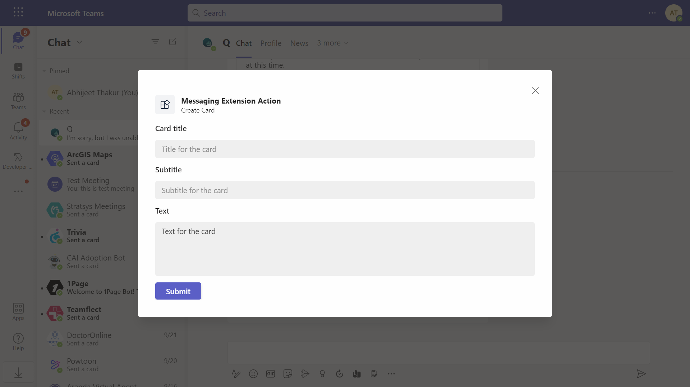
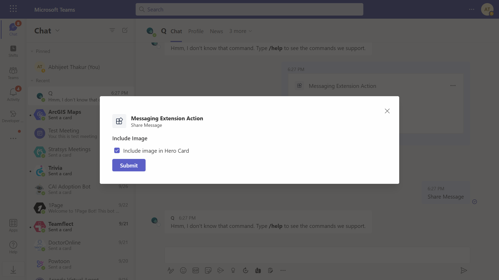
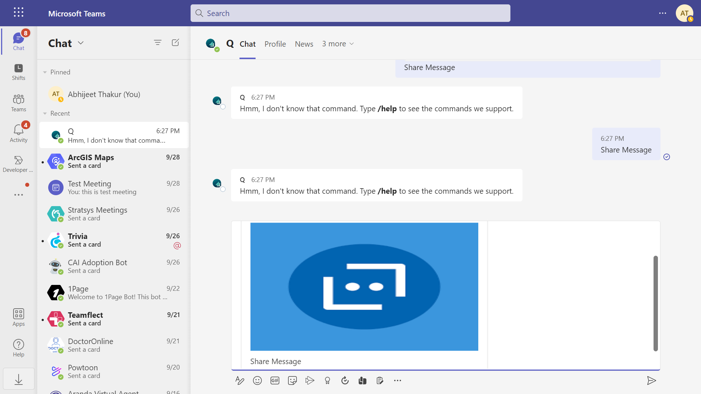

# Bots/Messaging Extension

*Bots* allow users to interact with your web service through text, interactive cards, and task modules. *Messaging extensions* allow users to interact with your web service through buttons and forms in the Microsoft Teams client. They can search, or initiate actions, in an external system from the compose message area, the command box, or directly from a message.

## Prerequisites

**Dependencies**
-  [NodeJS](https://nodejs.org/en/)
-  [ngrok](https://ngrok.com/) or equivalent tunneling solution
-  [M365 developer account](https://docs.microsoft.com/en-us/microsoftteams/platform/concepts/build-and-test/prepare-your-o365-tenant) or access to a Teams account with the appropriate permissions to install an app.

**Configure Ngrok**

Your app will be run from a localhost server. You will need to setup Ngrok in order to tunnel from the Teams client to localhost. 

**Run Ngrok**

Run ngrok - point to port 3978

`ngrok http -host-header=rewrite 3978`

**Update Bot Framework Messaging Endpoint**

  Note: You can also do this with the Manifest Editor in App Studio if you are familiar with the process.

- For the Messaging endpoint URL, use the current `https` URL you were given by running ngrok and append it with the path `/api/messages`. It should like something work `https://{subdomain}.ngrok.io/api/messages`.

- Click on the `Bots` menu item from the toolkit and select the bot you are using for this project.  Update the messaging endpoint and press enter to save the value in the Bot Framework.

- Ensure that you've [enabled the Teams Channel](https://docs.microsoft.com/en-us/azure/bot-service/channel-connect-teams?view=azure-bot-service-4.0)

## Build and run

### `npm install`

### `npm start`

## Deploy to Teams
Start debugging the project by hitting the `F5` key or click the debug icon in Visual Studio Code and click the `Start Debugging` green arrow button.

