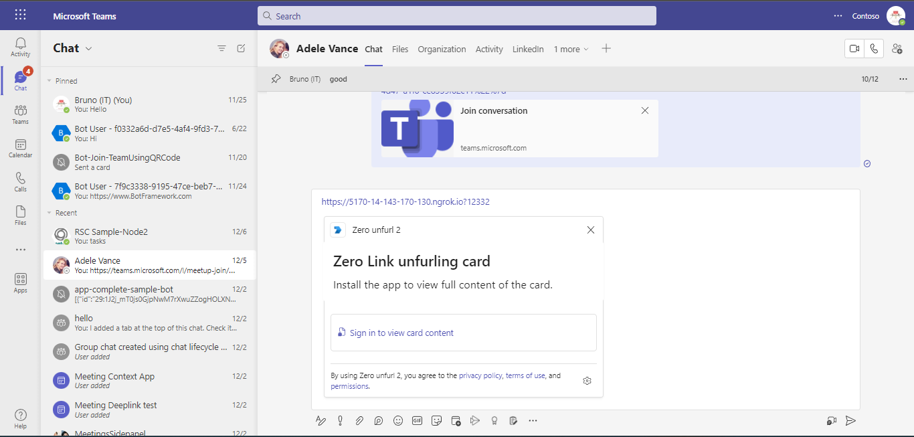
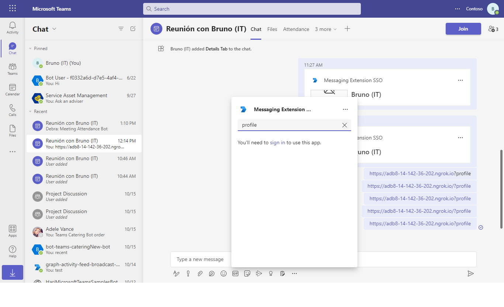
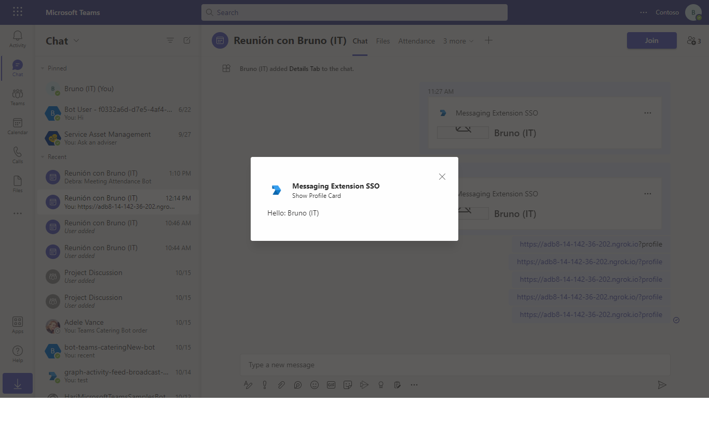

# Messaging Extension SSO Config Bot

Bot Framework v4 sample for Teams to include a configuration page and Bot Service SSO authentication.

## Interaction with app

 

## Prerequisites

- Microsoft Teams is installed and you have an account
- [NodeJS](https://nodejs.org/en/) version v16.14.2 or Higher Version
- [ngrok](https://ngrok.com/download   ) or equivalent tunnelling solution

This bot has been created using [Bot Framework](https://dev.botframework.com), it shows how to use a Messaging Extension configuration page, as well as how to sign in from a search Messaging Extension.

## Setup

> Note these instructions are for running the sample on your local machine, the tunnelling solution is required because
the Teams service needs to call into the bot.
1. Setup for Bot SSO     
    Refer to [Bot SSO Setup document](https://github.com/OfficeDev/Microsoft-Teams-Samples/blob/main/samples/bot-conversation-sso-quickstart/BotSSOSetup.md). 
 
2. Setup NGROK
   - Run ngrok - point to port 3978

    ```bash
    ngrok http -host-header=rewrite 3978
    ```
3. Setup for code

  - Clone the repository

    ```bash
    git clone https://github.com/OfficeDev/Microsoft-Teams-Samples.git
    ```

  - Update the `.env` configuration for the bot to use the Microsoft App Id and App Password from the Bot Framework registration. The `SiteUrl` is the URL that generated by ngrok and start with "https". (Note the MicrosoftAppId is the AppId created in step 1., the MicrosoftAppPassword is referred to as the "client secret" in step1.2 and you can always create a new client secret anytime.)

 - Run your bot sample
Under the root of this sample folder, build and run by commands:
- `npm install`
- `npm start`

4. Setup Manifest for Teams
- __*This step is specific to Teams.*__
    - **Edit** the `manifest.json` contained in the ./appPackage folder to replace your Microsoft App Id (that was created when you registered your app registration earlier) *everywhere* you see the place holder string `{{Microsoft-App-Id}}` (depending on the scenario the Microsoft App Id may occur multiple times in the `manifest.json`)
    - **Edit** the `manifest.json` for `validDomains` and replace `{{domain-name}}` with base Url of your domain. E.g. if you are using ngrok it would be `https://1234.ngrok.io` then your domain-name will be `1234.ngrok.io`.
    - **Zip** up the contents of the `appPackage` folder to create a `manifest.zip` (Make sure that zip file does not contains any subfolder otherwise you will get error while uploading your .zip package)

- Upload the manifest.zip to Teams (in the Apps view click "Upload a custom app")
   - Go to Microsoft Teams. From the lower left corner, select Apps
   - From the lower left corner, choose Upload a custom App
   - Go to your project directory, the ./appPackage folder, select the zip folder, and choose Open.
   - Select Add in the pop-up dialog box. Your app is uploaded to Teams.

- **Interacting with the Message Extension in Teams
    Once the Messaging Extension is installed, find the icon for **Config Auth Search** in the Compose Box's Messaging Extension menu. Right click to choose **Settings** and view the Config page. Click the icon to display the search window, type anything it will show your profile picture.

Note:- If you are facing any issue in your app,  [please uncomment this line](https://github.com/OfficeDev/Microsoft-Teams-Samples/blob/main/samples/msgext-search-sso-config/nodejs/index.js#L43) and put your debugger for local debug.
    
## Deploy the bot to Azure

To learn more about deploying a bot to Azure, see [Deploy your bot to Azure](https://aka.ms/azuredeployment) for a complete list of deployment instructions.

## Running the sample

**Zero install link unfurling card**


**Sign in on search:**


**Configuration page:**


**Display profile on search:**


**Profile card:**


**Signout:**


## Further reading

- [How Microsoft Teams bots work](https://docs.microsoft.com/en-us/azure/bot-service/bot-builder-basics-teams?view=azure-bot-service-4.0&tabs=javascript)

- [Zero Install Link Unfurling](https://learn.microsoft.com/en-us/microsoftteams/platform/messaging-extensions/how-to/link-unfurling?tabs=dotnet%2Cadvantages#zero-install-for-link-unfurling)

