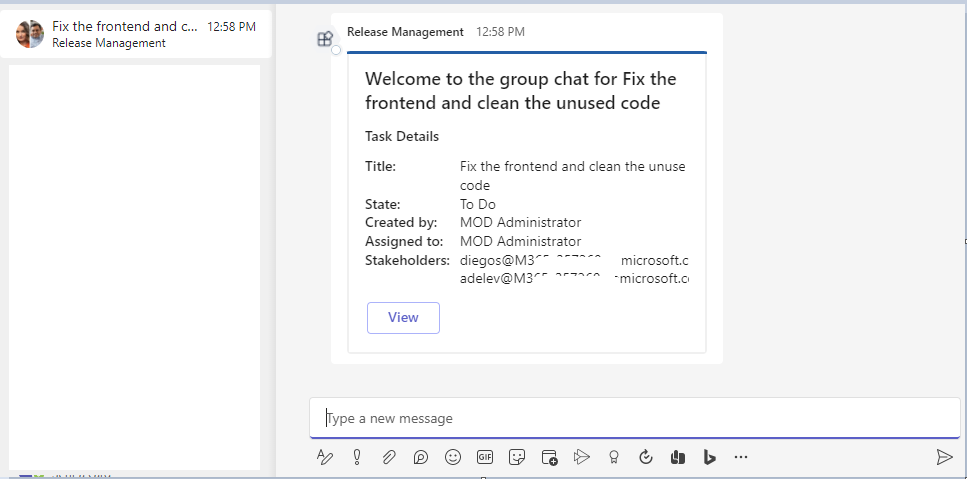
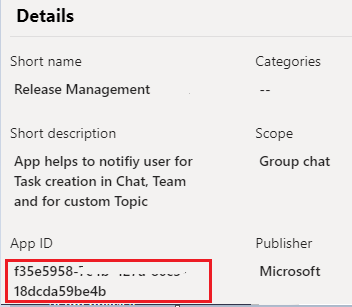

# Bot to create the group chat and send task notification using Azure webhooks.

This is a sample application which demonstrates how to create a webhook on [Azure DevOps](https://dev.azure.com) and connect with Teams bot that creates a group chat and send workitems details.

## Key features




## Prerequisites

- Microsoft Teams is installed and you have an account (not a guest account)
-  [NodeJS](https://nodejs.org/en/)
-  [ngrok](https://ngrok.com/) or equivalent tunneling solution
-  [M365 developer account](https://docs.microsoft.com/en-us/microsoftteams/platform/concepts/build-and-test/prepare-your-o365-tenant) or access to a Teams account with the appropriate permissions to install an app.
-  [Azure DevOps](https://dev.azure.com) access to set up service hooks and add custom field in workitem.
-  [Teams Admin portal](https://admin.teams.microsoft.com) access to upload the manifest.json.

## To try this sample

> Note these instructions are for running the sample on your local machine, the tunnelling solution is required because
> the Teams service needs to call into the bot.

### 1. Start ngrok on localhost:3978
- Open ngrok and run command `ngrok http -host-header=rewrite 3978` 
- Once started you should see URL  `https://41ed-abcd-e125.ngrok.io`. Copy it, this is your baseUrl that will used as endpoint for Azure bot and webhook.


### 2. Setup Azure DevOps service hook.
- Follow this document- [Create Webhooks](https://docs.microsoft.com/en-us/azure/devops/service-hooks/services/webhooks?view=azure-devops) to service hook. 
- Make sure to select trigger as *Work item created*
- Make sure to add URL as https://{baseUrl}/api/workItem. It will look somethihng as https://41ed-abcd-e125.ngrok.io/api/workItem. *Here baseUrl is referred to URL we get in step 1*.

### 3. Setup custom work item type.
- Follow the doc to [Add a custom field to an inherited process - Azure DevOps Services](https://docs.microsoft.com/en-us/azure/devops/organizations/settings/work/add-custom-field?view=azure-devops). 
- Make sure to give name as *StakeholderTeam* and Type *Text (Single line)*


- Make sure to [Apply the customized process to your project](https://docs.microsoft.com/en-us/azure/devops/organizations/settings/work/add-custom-field?view=azure-devops#apply-the-customized-process-to-your-project)
- Go to *Options* and check *Required* and Add.

### 4. Register Azure AD application
Register one Azure AD application in your tenant's directory: for the bot and tab app authentication.

-  Log in to the Azure portal from your subscription, and go to the "App registrations" blade  [here](https://portal.azure.com/#blade/Microsoft_AAD_IAM/ActiveDirectoryMenuBlade/RegisteredApps). Ensure that you use a tenant where admin consent for API permissions can be provided.

-  Click on "New registration", and create an Azure AD application.

-  **Name:**  The name of your Teams app - if you are following the template for a default deployment, we recommend "App catalog lifecycle".

-  **Supported account types:**  Select "Accounts in any organizational directory"

-  Leave the "Redirect URL" field blank.   

- Click on the "Register" button.

7.  When the app is registered, you'll be taken to the app's "Overview" page. Copy the  **Application (client) ID**; we will need it later. Verify that the "Supported account types" is set to  **Multiple organizations**.

-  On the side rail in the Manage section, navigate to the "Certificates & secrets" section. In the Client secrets section, click on "+ New client secret". Add a description for the secret and select Expires as "Never". Click "Add".

-  Once the client secret is created, copy its  **Value**, please take a note of the secret as it will be required later.


- At this point you have 3 unique values:
    -   Application (client) ID which will be later used during Azure bot creation
    -   Client secret for the bot which will be later used during Azure bot creation
    -   Directory (tenant) ID
We recommend that you copy these values into a text file, using an application like Notepad. We will need these values later.

-  Under left menu, navigate to  **API Permissions**, and make sure to add the following permissions of Microsoft Graph API > Application permissions:
    -  Chat.Create
    -  TeamsAppInstallation.ReadWriteForChat.All

Click on Add Permissions to commit your changes.

- If you are logged in as the Global Administrator, click on the Grant admin consent for %tenant-name% button to grant admin consent else, inform your admin to do the same through the portal or follow the steps provided here to create a link and send it to your admin for consent.

- Global Administrator can grant consent using following link:  [https://login.microsoftonline.com/common/adminconsent?client_id=](https://login.microsoftonline.com/common/adminconsent?client_id=)<%appId%> 

### 5. Setup a Azure bot resource
- Create new Azure Bot resource in Azure.
- Select Type of App as "Multi Tenant"
-  Select Creation type as "Use existing app registration"
- Use the copied App Id and Client secret from above step and fill in App Id and App secret respectively.
- Click on Create on the Azure bot.   
- Go to the created resource, navigate to channels and add "Microsoft Teams".
- Ensure that you've [enabled the Teams Channel](https://docs.microsoft.com/en-us/azure/bot-service/channel-connect-teams?view=azure-bot-service-4.0)

### 6. Manually update the manifest.json and publish to Teams admin portal
- Edit the `manifest.json` contained in the  `/AppManifest` folder to and fill in MicrosoftAppId (that was created in step 1 and it is the same value of MicrosoftAppId as in `.env` file) *everywhere* you see the place holder string `<<Microsoft-App-Id>>` (depending on the scenario it may occur multiple times in the `manifest.json`)
- Zip up the contents of the `/appPackage` folder to create a `manifest.zip`
- Login to [Teams Admin portal](https://admin.teams.microsoft.com) 
- Under *Teams apps*, select *Manage apps* and then click on *+ Upload* to upload the zip created.


- Once uploaded search the application and under About copy *App ID*. We will need it in next step.



### 7. To try this sample

- In a terminal, navigate to `ReleaseManagement`

    ```bash
    # change into project folder
    cd # ReleaseManagement
    ```

- Run the bot from a terminal or from Visual Studio, choose option A or B.

  A) From a terminal

  ```bash
  # run the bot
  dotnet run
  ```

  B) Or from Visual Studio

  - Launch Visual Studio
  - File -> Open -> Project/Solution
  - Navigate to `samples/release-management/csharp` folder
  - Select `ReleaseManagement.csproj` file
  - Press `F5` to run the project

## Deploy the bot to Azure

To learn more about deploying a bot to Azure, see [Deploy your bot to Azure](https://aka.ms/azuredeployment) for a complete list of deployment instructions.


## Interacting with the bot.
- Login into [Azure DevOps](https://dev.azure.com) and open the project where custom process was applied.
- Create a new workitem -> Tasks, provide comma seprated email ids in *StakeHolderTeam* (NOTE: The email should belong to tenant where we register Application in step 4)
- Save
- Bot will create the group chat with members you added and send the Task details.

