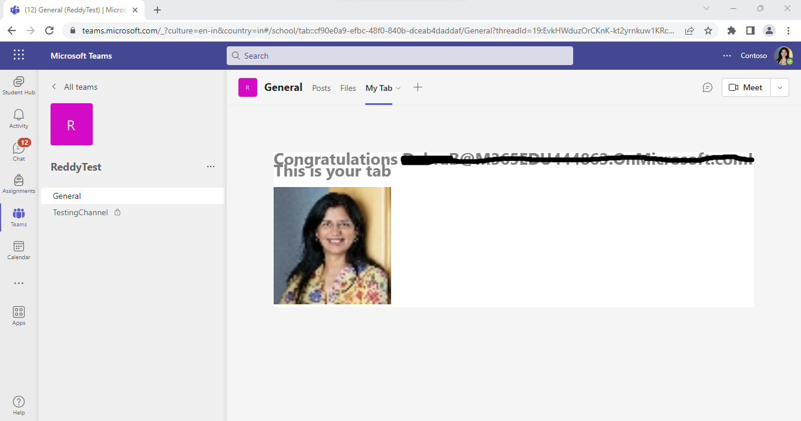

# Teams Tab SSO Authentication

Tabs are Teams-aware webpages embedded in Microsoft Teams. Personal tabs are scoped to a single user. They can be pinned to the left navigation bar for easy access.

## Prerequisites
-  [NodeJS](https://nodejs.org/en/)

-  [ngrok](https://ngrok.com/)

-  [M365 developer account](https://docs.microsoft.com/en-us/microsoftteams/platform/concepts/build-and-test/prepare-your-o365-tenant) or access to a Teams account with the appropriate permissions to install an app.

-  [Create an Azure AD App registration to support SSO and the User.Read Graph API](https://aka.ms/teams-toolkit-sso-appreg)

## ngrok

Teams needs to access your tab from a publically accessible URL. If you are running your app in localhost, you will need to use a tunneling service like ngrok. Run ngrok and point it to localhost.
  `ngrok http -host-header=rewrite 3000`

## Set up the client .env with the following keys:
    - `"REACT_APP_AZURE_APP_REGISTRATION_ID"` : Application ID of the Azure AD application
    - `"REACT_APP_BASE_URL"` : Ngrok URL you get after running the ngrok command.

## Set up the api-server .env with the following keys:
Go to the folder api-server and update following values in .env files

    - `"CLIENT_ID"` : Application ID of the Azure AD application
    - `"CLIENT_SECRET"` : Application secret of the Azure AD application

## Build and Run
You can build and run the project from the command line or an IDE:

1. Navigate to the Project root folder
2. Build Client
    - Open terminal
    - Install pacakge with npm install
    - npm run build
3. Run Client
    - Open new terminal
    - npm start
    - The client will start running on 3000 port
4. Run Server
    - Open new terminal
    - Change directory to `api-server` folder with command i.e. `cd api-server`
    - Install pacakge with npm install
    - npm start
    - The server will start running on 5000 port
5. Update the manifest's `<<REACT_APP_AZURE_APP_REGISTRATION_ID>>` & `<<REACT_APP_BASE_URL>>` with their repective values and zip it under appPackage folder
6. Now your application is running and ready to upload

## Deploy to Teams
Start debugging the project by hitting the `F5` key or click the debug icon in Visual Studio Code and click the `Start Debugging` green arrow button.

### NOTE: First time debug step
On the first time running and debugging your app you need allow the localhost certificate.  After starting debugging when Chrome is launched and you have installed your app it will fail to load.

- Open a new tab `in the same browser window that was opened`
- Navigate to `https://localhost:3000/tab`
- Click the `Advanced` button
- Select the `Continue to localhost`

### NOTE: Debugging
Ensure you have the Debugger for Chrome/Edge extension installed for Visual Studio Code from the marketplace.

