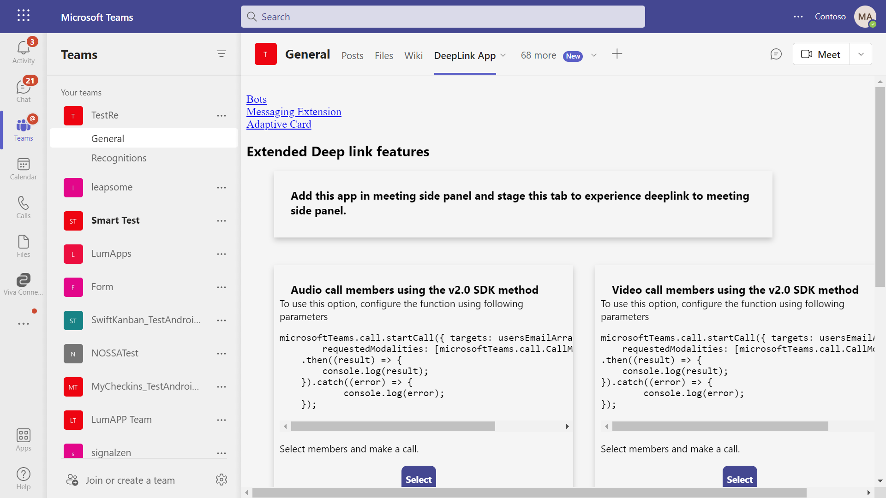
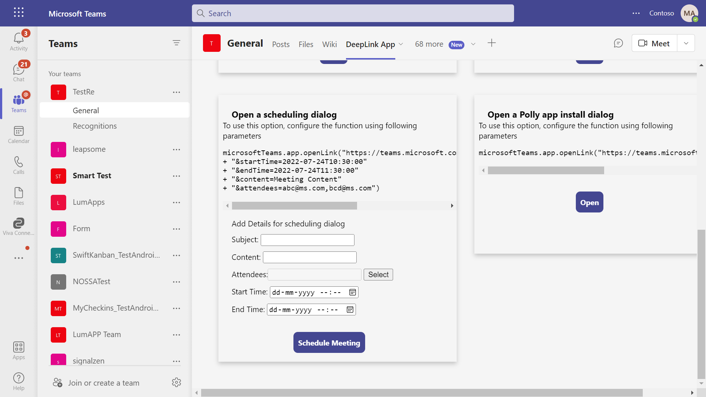
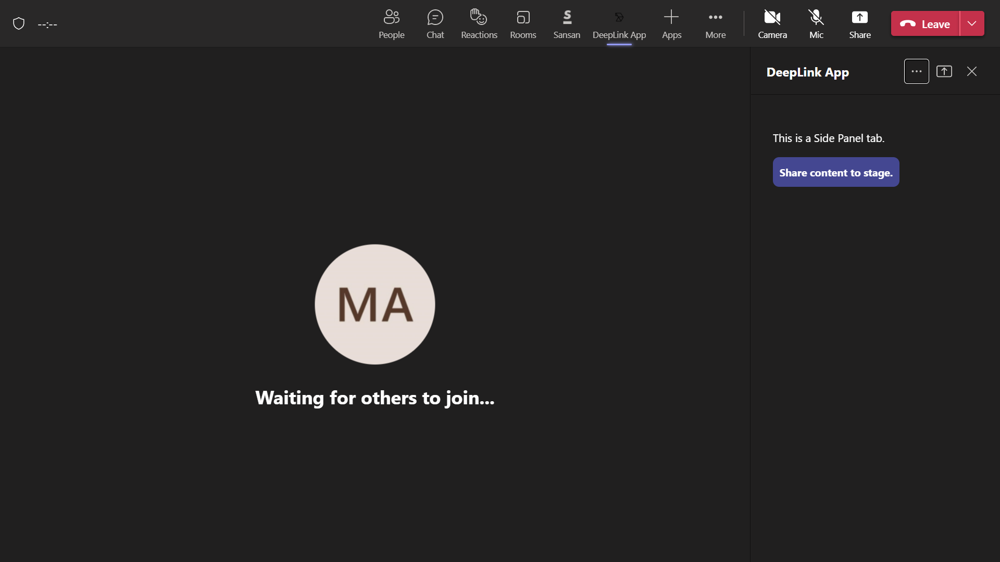
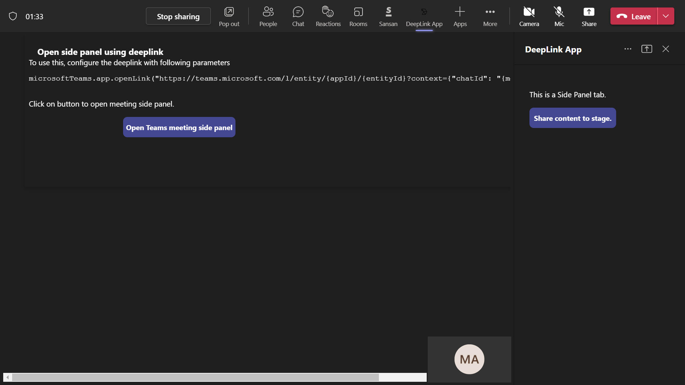

# DeepLink

This sample displays how to consume SubEntity Id to [DeepLink](https://docs.microsoft.com/en-us/microsoftteams/platform/concepts/build-and-test/deep-links#deep-linking-to-your-tab) from Bot to Tab and Tab to Tab.

## Interaction with app.


## Prerequisites
- Microsoft Teams is installed and you have an account (not a guest account)
- To test locally, [NodeJS](https://nodejs.org/en/download/) must be installed on your development machine (version 16.14.2  or higher)
- [ngrok](https://ngrok.com/download) or equivalent tunneling solution
- [M365 developer account](https://docs.microsoft.com/en-us/microsoftteams/platform/concepts/build-and-test/prepare-your-o365-tenant) or access to a Teams account with the 

## Setup.

1. Register a new application in the [Azure Active Directory – App Registrations](https://go.microsoft.com/fwlink/?linkid=2083908) portal. 
    
2. Setup for Bot
- In Azure portal, create a [Azure Bot resource](https://docs.microsoft.com/en-us/azure/bot-service/bot-builder-authentication?view=azure-bot-service-4.0&tabs=csharp%2Caadv2).
- Ensure that you've [enabled the Teams Channel](https://docs.microsoft.com/en-us/azure/bot-service/channel-connect-teams?view=azure-bot-service-4.0)
- While registering the bot, use `https://<your_ngrok_url>/api/messages` as the messaging endpoint.
**NOTE:** When you create app registration, you will create an App ID and App password - make sure you keep these for later.

3. Setup NGROK
   - Run ngrok - point to port 3978

    ```bash
    ngrok http -host-header=rewrite 3978
    ```
4. Setup for code

  - Clone the repository

    ```bash
    git clone https://github.com/OfficeDev/Microsoft-Teams-Samples.git
    ```
  - Update the `.env` configuration for the bot to use the `YOUR-MICROSOFT-APP-ID`, `YOUR-MICROSOFT-APP-PASSWORD` and 'BASE-URL' is ngrok url eg. 124.ngrok.io. (Note the MicrosoftAppId is the AppId created in step 1 (Setup for Bot), the MicrosoftAppPassword is referred to as the "client secret" in step 1 (Setup for Bot) and you can always create a new client secret anytime.)

    - In a terminal, navigate to `samples/tab-deeplink/nodejs`

        ```bash
        cd samples/tab-deeplink/nodejs
        ```

    - Install modules

        ```bash
        npm install
        ```

    - Start the bot

        ```bash
        npm start
        ```
    - If you are using Visual Studio code
     - Launch Visual Studio code
     - Folder -> Open -> Project/Solution
     - Navigate to ```samples/tab-deeplink/nodejs``` folder
     - Select ```nodejs``` Folder
     
     - To run the application required  node modules.Please use this command to install modules npm i.

5. Setup Manifest for Teams
- __*This step is specific to Teams.*__
    - **Edit** the `manifest.json` contained in the ./Manifest folder to replace your Microsoft App Id (that was created when you registered your app registration earlier) *everywhere* you see the place holder string `<<YOUR-MICROSOFT-APP-ID>>` (depending on the scenario the Microsoft App Id may occur multiple times in the `manifest.json`)
    - **Edit** the `manifest.json` for `validDomains` and replace `{{domain-name}}` with base Url of your domain. E.g. if you are using ngrok it would be `https://1234.ngrok.io` then your domain-name will be `1234.ngrok.io`.
    **Note:** If you want to test your app across multi hub like: Outlook/Office.com, please update the `manifest.json` in the `tab-deeplink\nodejs\Manifest_Hub` folder with the required values.
    - **Zip** up the contents of the `Manifest` folder to create a `Manifest.zip` or `Manifest_Hub` folder to create a `Manifest_Hub.zip`(Make sure that zip file does not contains any subfolder otherwise you will get error while uploading your .zip package)

- Upload the manifest.zip to Teams (in the Apps view click "Upload a custom app")
   - Go to Microsoft Teams. From the lower left corner, select Apps
   - From the lower left corner, choose Upload a custom App
   - Go to your project directory, the ./Manifest folder, select the zip folder, and choose Open.
   - Select Add in the pop-up dialog box. Your app is uploaded to Teams.

**Note**: If you are facing any issue in your app, [please uncomment this line](https://github.com/OfficeDev/Microsoft-Teams-Samples/blob/main/samples/tab-deeplink/nodejs/index.js#L62) and put your debugger for local debug.

## Interacting with the bot

Enter text in the emulator.  The text will be echoed back by the bot.
1. Interact with DeepLink bot by pinging it in personal or channel scope. 


2. Select the option from the options displayed in the adaptive card. This will redirect to the respective Task in the Tab.


3. Click on Back to List to view all the options and additional features of deep link using Microsoft teams SDK v2.0.0. User can select an option which will redirect to the respective Task in the Tab.





4. Add this application in live meeting and stage the content.



5. While it's in stage view, using same [deeplink to open tab](https://docs.microsoft.com/en-us/microsoftteams/platform/concepts/build-and-test/deep-links?tabs=teamsjs-v2#generate-a-deep-link-to-your-tab) will open the meeting side panel tab.



## Outlook on the web

- To view your app in Outlook on the web.

- Go to [Outlook on the web](https://outlook.office.com/mail/)and sign in using your dev tenant account.

**On the side bar, select More Apps. Your sideloaded app title appears among your installed apps**


**Select your app icon to launch and preview your app running in Outlook on the web**


**Note:** Similarly, you can test your application in the Outlook desktop app as well.

## Office on the web

- To preview your app running in Office on the web.

- Log into office.com with test tenant credentials

**Select the Apps icon on the side bar. Your sideloaded app title appears among your installed apps**


**Select your app icon to launch your app in Office on the web**

 

**Note:** Similarly, you can test your application in the Office 365 desktop app as well.

 ## Further reading

- [Extend Teams apps across Microsoft 365](https://learn.microsoft.com/en-us/microsoftteams/platform/m365-apps/overview)

