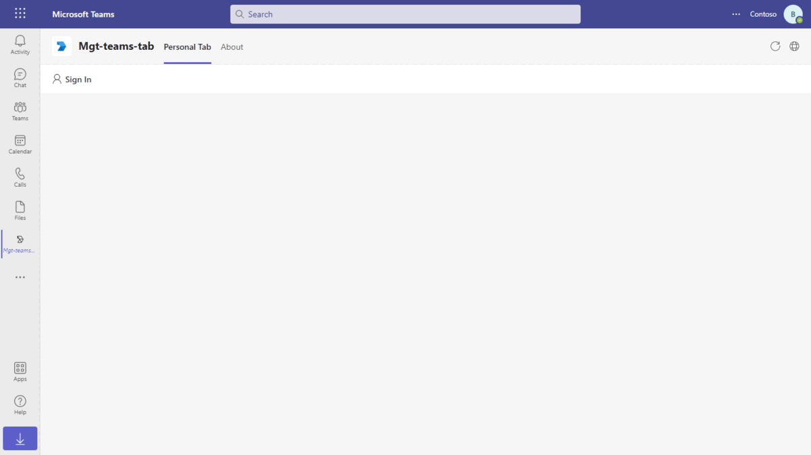
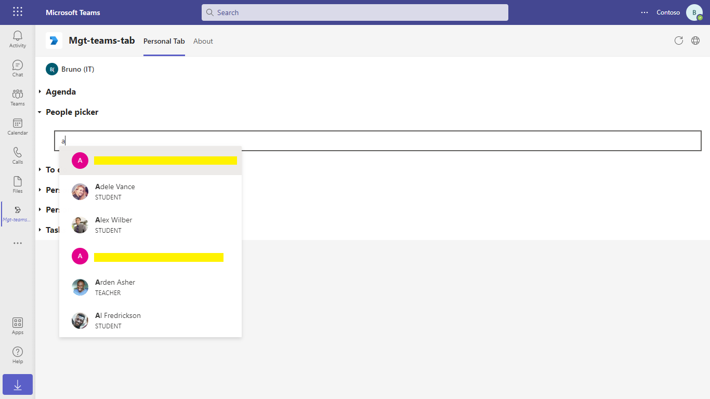
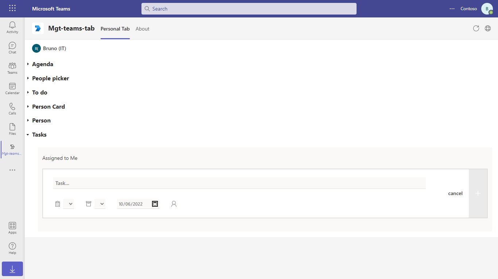
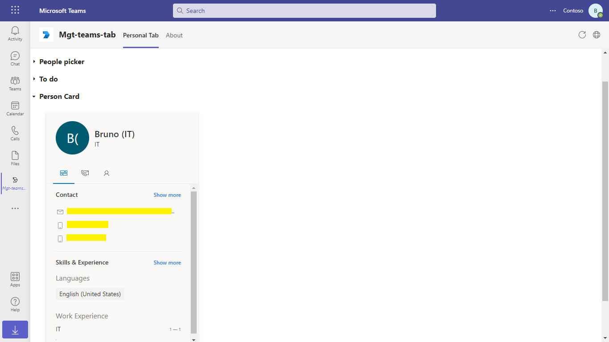
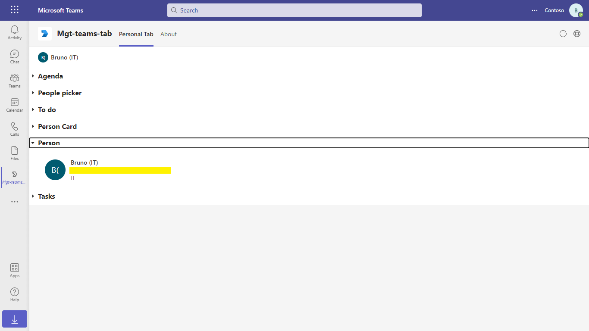

# Teams tab with microsoft graph toolkit

This is the demo app for [Teams tab using miscrosoft graph toolkit](https://docs.microsoft.com/en-us/graph/toolkit/get-started/build-a-microsoft-teams-tab?tabs=unpkg%2Cjs)

## Interaction with app



## Prerequisites

- [.NET Core SDK](https://dotnet.microsoft.com/download) version 3.1

  determine dotnet version
  ```bash
  dotnet --version
  ```
- [Ngrok](https://ngrok.com/download) (For local environment testing) Latest (any other tunneling software can also be used)
  
- [Teams](https://teams.microsoft.com) Microsoft Teams is installed and you have an account

## Setup
 1. Register a new application in the [Azure Active Directory – App Registrations](https://go.microsoft.com/fwlink/?linkid=2083908) portal.
  -  Configuring MSAL2.0 Auth Provider
  - Register your app with Microsoft identity platform via the Azure AD portal
  - Your app must be registered in the Azure AD portal to integrate with the Microsoft identity platform. See [Register an application with the Microsoft identity platform](https://docs.microsoft.com/en-us/graph/auth-register-app-v2).
  - Click on Add a Platform in redirect URI section.
  - Select Single Page Application and add following URL `<<base-url>>/tabauth`
  - Save and register.
  - Once App is registerd copy the `client_Id` for your app and update in the app.

 2. Setup for Bot
- Register a AAD aap registration in Azure portal.
- Also, register a bot with Azure Bot Service, following the instructions [here](https://docs.microsoft.com/en-us/azure/bot-service/bot-service-quickstart-registration?view=azure-bot-service-3.0).
- Ensure that you've [enabled the Teams Channel](https://docs.microsoft.com/en-us/azure/bot-service/channel-connect-teams?view=azure-bot-service-4.0)


    > NOTE: When you create your app registration, you will create an App ID and App password - make sure you keep these for later.

3. Setup NGROK
 - Run ngrok - point to port 3978

  ```bash
   ngrok http -host-header=rewrite 3978
  ```

4. Setup for code

- Clone the repository

    ```bash
    git clone https://github.com/OfficeDev/Microsoft-Teams-Samples.git
    ```

- Modify Update `client_Id` copied from step 1 in index.tsx file(samples/tab-graph-toolkit/csharp/TabGraphToolkit/clientapp/src)

  - In a terminal, navigate to `samples/tab-graph-toolkit/csharp`

    change into project folder
    ```bash
    cd # TabGraphToolkit
    ```
 - Install modules
   navigate to `samples/tab-graph-toolkit/csharp/TabGraphToolkit/ClientApp`

    ```bash
    npm install
    ```
   A) From a terminal
     ```bash
     # run the bot
     dotnet run
     ```

   B) Or from Visual Studio
     - Launch Visual Studio
     - File -> Open -> Project/Solution
     - Navigate to `TabGraphToolkit` folder
     - Select `TabGraphToolkit.csproj` file
     - Press `F5` to run the project 
     
5. Setup Manifest for Teams
- __*This step is specific to Teams.*__
    - **Edit** the `manifest.json` contained in the ./AppPackage folder to replace your Microsoft App Id (that was created when you registered your app registration earlier) *everywhere* you see the place holder string `{{Microsoft-App-Id}}` (depending on the scenario the Microsoft App Id may occur multiple times in the `manifest.json`)
    - **Edit** the `manifest.json` for `validDomains` and replace `{{domain-name}}` with base Url of your domain. E.g. if you are using ngrok it would be `https://1234.ngrok.io` then your domain-name will be `1234.ngrok.io`.
    - **Zip** up the contents of the `AppPackage` folder to create a `manifest.zip` (Make sure that zip file does not contains any subfolder otherwise you will get error while uploading your .zip package)

- Upload the manifest.zip to Teams (in the Apps view click "Upload a custom app")
   - Go to Microsoft Teams. From the lower left corner, select Apps
   - From the lower left corner, choose Upload a custom App
   - Go to your project directory, the ./AppPackage folder, select the zip folder, and choose Open.
   - Select Add in the pop-up dialog box. Your app is uploaded to Teams. 
   
## Running the sample
Once you access the Tab within your app you will be able to see following microsoft-graph-toolkit component. 

- `<mgt-login>`


- `<mgt-agenda>`


- `<mgt-people-picker>`



- `<mgt-tasks>`



- `<mgt-todo>`


- `<mgt-person-card>`



- `<mgt-person>`



## Further Reading
[Tab-graph-toolkit](https://learn.microsoft.com/en-us/graph/toolkit/get-started/build-a-microsoft-teams-tab?tabs=unpkg%2Chtml)
